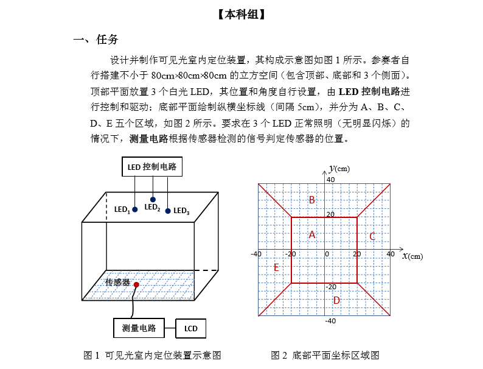
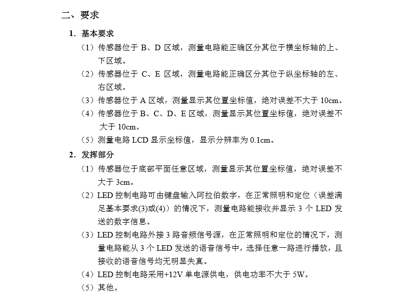

## 回顾

今年暑假基本上待在了学校，一方面是因为准备出去工作，争取再学点东西；另一方面便是准备下17年8月的全国大学生电子竞赛。

赛场是我们学院所在的实验室，比赛期间几乎都待在实验室。

我们选的题目是**I组-室内可见光定位**，有很多成员贡献出可行的方案，也逐步尝试突破。

## 前言

竞赛不仅练就的是承受压力的能力和团队协作能力，也是对本身所学知识的总结利用。故在这篇博客中我想对我们组针对电赛I题的解决方案做一些汇总。

因为通过了广西区的评比之后，将我们的作品进行了封箱处理，所以在此时我记录这件事，没有办法提供实物图样以及演示效果展示，我尽量将一些细节描述清楚。

## 正文

### 电子竞赛I组题目以及其要求





### 解决方案参考

#### 解决方案一：利用LED频闪，光通信时间差计算距离

将LED灯放置于顶部三个不同位置，根据不同位置光通信时间差，计算出接收点位置。该方案是首先实行的，但是对硬件性能要求高，比如LED的频闪，传感器的延迟都会导致出现很大的误差。

**结论：**不可行

#### 解决方案二：多个面放置光线强度传感器，通过光线强度计算出大致位置

将`LED灯`放于顶部中心，并将底部的接收器做成金字塔样式，四个面分别贴和放置一个光线强度传感器，这样在底部不同位置，根据每个面的不同光照强度，从而判断底部传感器所在位置。该方案较为容易实现，但是受环境影响大，可以判断传感器大致所在区域，并不能确定其精确位置。

方案被其中一个小组采用，并作为一个作品去参与了竞赛，拿到了广西区二等奖。

**结论：**可行，但不精确

#### 解决方案三：摄像头拍摄定位LED，根据画面光斑位置计算需定位物体位置

采用底部放置摄像头的方式，说实话是铤而走险的方案（历年的竞赛中有过类似题目，有禁止使用摄像头的先例）。

该方案是再顶部面板中心放置单点光源LED灯，点亮的LED灯会在上顶部面板中形成亮斑，而摄像头则至于底部，用于捕捉该白色色斑，根据其亮斑在采集图像中的相对位置，计算出底部摄像头（传感器）的位置。

**结论：**可行，且位置精准

### 方案选择

#### 元器件

- OpenMV2开发板
- 白光LED灯1w * 3
- 80cm * 80cm木制板 * 5
- 51单片机开发板
- 12864LCD液晶显示屏

#### 方案选择：方案三，摄像头定位光斑

**我们采用的是底部放置摄像头的方案，分为三个模块。**

**模块一是题中要求的`LED灯`，我们将三个`LED灯`汇聚成一个灯，让它看起来像是一个亮点，该点放置于顶部面板对角线交点；**

**模块二是传感器模块，我们将传感器模块水平放置于底部坐标面板上，并且摄像头的图像采集照片平面的长宽要和底部面板坐标轴平行；**

**模块三是数据显示模块，我们是用51单片机开发板结合12864LCD液晶显示器，通过串口接收数据，实现在屏幕上实时刷新当前坐标位置。**

#### 注意事项

1. 实物搭建：木制板`80*80cm*5`块形成立方体，内壁贴满黑色磨砂纸，可用于较少外界光以及立方体内`LED`灯反光干扰。
2. 捕捉白色色斑：我们设置为捕捉单点最亮白色色块，因为五面立方体，有一面暴露与室外环境，故室外光线太强会导致目标色斑捕捉错误。故我们将三个`LED灯`汇聚成一点，增强光照强度，即使在外界光照较为强烈的情况下也不会产生干扰。

### 主要代码

#### 测量设备：在OpenMV开发板中写入的代码

> 开发环境：`Python3.5`
>
> 更多教程可以参考@云江科技的教程：【[直达链接](https://openmv.cloudriver.tech/OpenMV%E4%BE%8B%E7%A8%8B%E8%A7%A3%E6%9E%90/10_%E9%A2%9C%E8%89%B2%E8%BF%BD%E8%B8%AA/%E8%89%B2%E5%9D%97%E8%AF%86%E5%88%AB/%E8%89%B2%E5%9D%97%E8%AF%86%E5%88%AB.html)】

```python
import sensor, image, time
from pyb import UART

uart = UART(3, 9600)  # 设置为串口3、波特率为9600发送数据
thresholds = (245, 255)  # 设置监测色块阈值

sensor.reset()  # 摄像头初始化
sensor.set_pixformat(sensor.GRAYSCALE)  # 设置为灰度模式
sensor.set_framesize(sensor.QQVGA)  # 画幅为QQVGA即分辨率为160*120
sensor.skip_frames(time=2000)  # 跳过起始画面，获取稳定图像
sensor.set_auto_gain(False)  # 在色块检测模式下关闭自动补光
sensor.set_auto_whitebal(False)  # 关闭白平衡
clock = time.clock()

xPositionNow = 0  # 初始化各坐标值
yPositionNow = 0
xPositionLast = 0
yPositionLast = 0
imageSize = 128

while True:
    clock.tick()
    img = sensor.snapshot()  # 获取当期所采集到的图像快照
    # 设置色块阈值，具体数值情况可以通过OpenMVIDE中的阈值调整功能来得出
    # 工具 → Mechine Vision → Threshold Editor
    # area_threshold面积阈值设置为100 ，如果色块被面积小于100，则会被过滤掉
    # pixels_threshold 像素个数阈值，如果色块像素数量小于这个值，会被过滤掉
    # merge 设置为True，合并所有重叠的寻找到的blob为一个色块
    for blob in img.find_blobs([thresholds], pixels_threshold=100, area_threshold=100, merge=True):
        # 绘制相应的图形，方便我们测试的时候使用
        img.draw_rectangle(blob.rect())
        img.draw_cross(blob.cx(), blob.cy())
        x = blob.cx() - (imageSize / 2)
        y = (imageSize / 2) - blob.cy()
        xPositionLast = xPositionNow
        yPositionLast = yPositionNow
        # 这个0.7的数值不固定，只是在调试的时候为了使得像素点和坐标单位cm匹配所设置的数值
        xPositionNow = x * 0.7
        yPositionNow = y * 0.7
        # 测试时打印出当前坐标
        print(xPositionNow, yPositionNow, end=',')
        # 通过串口将坐标数据发送给单片机处理，实际上发送的就是一段文本
        uart.write(',' + str(xPositionNow) + ',' + str((-1) * yPositionNow) + ',')
        # 判断当前所在区域（A\B\C\D）
        if abs(xPositionNow) < 20 and abs(yPositionNow) < 20:
            uart.write('A\n')
            print('A')
        elif yPositionNow < -20 and yPositionNow < xPositionNow and (-1) * yPositionNow > xPositionNow:
            uart.write('B\n')
            print('B')
        elif xPositionNow > 20 and (-1) * yPositionNow < xPositionNow and yPositionNow < xPositionNow:
            uart.write('C\n')
            print('C')
        elif yPositionNow > 20 and xPositionNow < yPositionNow and (-1) * xPositionNow < yPositionNow:
            uart.write('D\n')
            print('D')
        else:
            uart.write('E\n')
            print('E')
        # 0.5s更新一下坐标数据
        time.sleep(500)

```

#### 输出设备：显示设备的51单片机中写入的代码

```c
#include<reg52.h>
#include<stdio.h>
#include<string.h>
#include<stdlib.h>
#include<math.h>

#define uchar unsigned char
#define uint unsigned int
#define Buf_Max 80

#define GPS_Buffer_Length 80
#define gpsRxBufferLength  76

#define false 0
#define true 1

sbit led1 = P1^1;
sbit led2 = P1^2;

bit flag = 1;

typedef struct SaveData
{
	char GPS_Buffer[GPS_Buffer_Length];
	char isGetData;		//是否获取到GPS数据
	char isUsefull;		//定位信息是否有效
} xdata _SaveData;


char idata gpsRxBuffer[gpsRxBufferLength];
uchar RX_Count = 0;
_SaveData Save_Data;

char tempr;

#include "uart.h"
#include "lcd.h"

/*********初始化函数*********/
void init()
{
    TMOD=0x20;	  //设定定时器T1工作方式2
	PCON=0x00;	  //串口波特率正常9600，不加倍；
	SCON=0x50;	  //蓝牙串口工作方式为3
    TH1=0xfd;	  //T1定时器装初值
    TL1=0xfd;	  //T1定时器装初值
    TR1=1;		  //启动T1定时器
    REN=1;		  //允许串口接收
    SM0=0;		  //设定串口工作方式1
    SM1=1;		  //设定串口工作方式1
    EA=1;		  //开总中断
    ES=1;		  //开串口中断
		EX1=1;
}

/***********主函数**********/
void main()
{
	init();					 //初始化
	lcd_init();
	flag = 0;
  while(1)
	{
		printfGps();
//		write_cmd(0x01);
  }
}

void sint() interrupt 4
{
	ES=0;
	if(RI == 1 && flag == 0)
	{
		RI=0;
		tempr=SBUF;

		if(tempr == '\n')
		{
			memset(Save_Data.GPS_Buffer, 0, GPS_Buffer_Length);      //清空
			memcpy(Save_Data.GPS_Buffer, gpsRxBuffer, RX_Count); 	//保存数据
			Save_Data.isGetData = true;
			RX_Count = 0;
			memset(gpsRxBuffer, 0, gpsRxBufferLength);      //清空
			gpsRxBuffer[RX_Count] = '\0';//添加结束符
		}
		else
		{
			gpsRxBuffer[RX_Count++] = tempr;
		}
	}
	ES=1;
}

```


## 写在最后

发现写博客虽然对巩固知识很有帮助，但是也确实是一件费时费力的事情。

本来计划详细讲解一下过程，分享一下经验，但马上要出学校开始找工作了，觉得时间完全不够用啊。包括写这篇博文记录一下，中间也是跨了一个多月的时间才重新总结，所以想想先把分析思路和主要代码贴出来，关于更多具体的分析，就不再赘述了。
