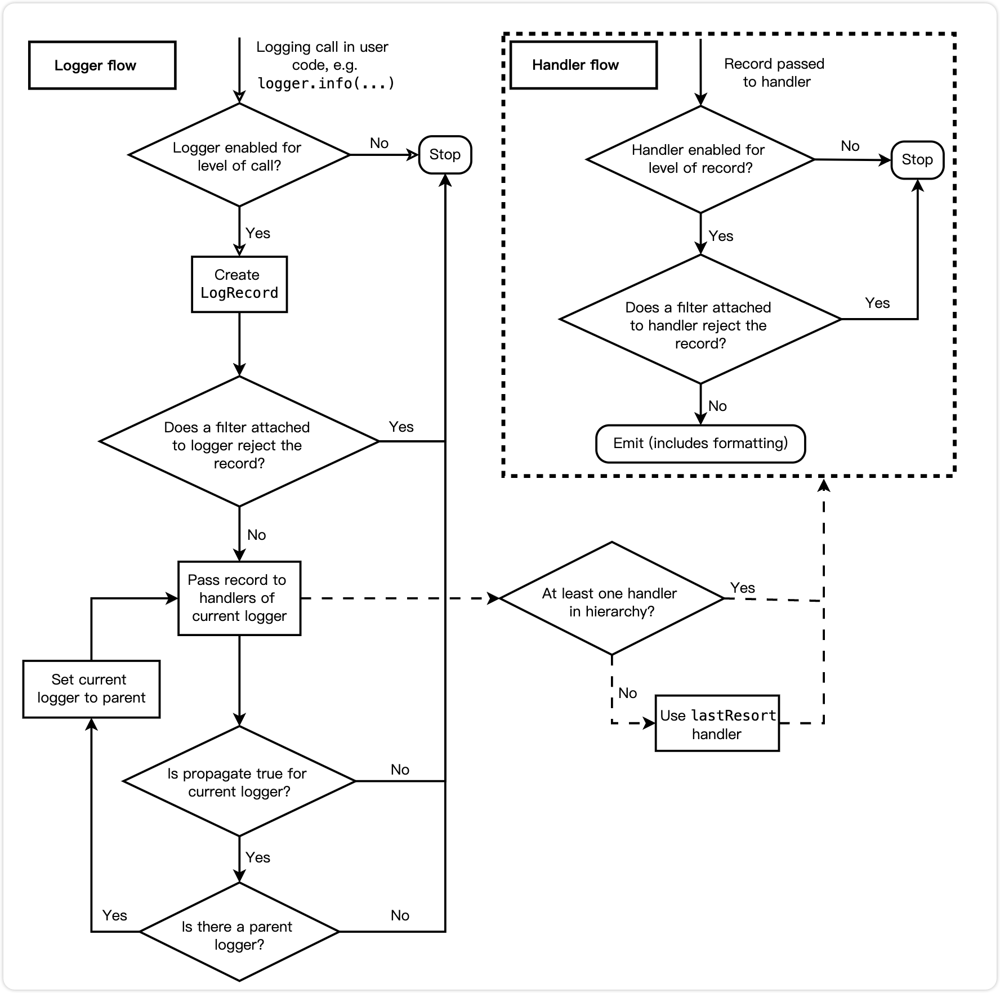

# 故障背景

## 运行环境

```requirements
# sys.version
# '3.10.9 (main, Jan 31 2023, 16:44:05) [Clang 14.0.0 (clang-1400.0.29.202)]'

Scrapy==2.9.0
apache-airflow==2.6.2
```

我所在的项目组会使用 Scrapy 作为爬虫框架进行数据采集，其中采集任务由 apache-airflow 负责调度。

Scrapy 采集程序和 Airflow 调度程序，作为项目下完全独立的两个功能模块运行。

一次在 Scrapy 爬虫开发过程中，误导入了 airflow 模块下的功能，CodeReview 也未意识到这个错误。
在正式环境上线后，Scrapy 爬虫出现了重复日志输出，且输出了 `DEBUG` 以上级别的日志，这与 Scrapy `settings.LOG_LEVEL="INFO"`
所设定日志等级不符合。

上线后程序刷大量 `DEBUG` 级别以上的重复日志，无法正常通过爬虫日志观察运行情况，爬虫程序的负载飙升，采集能力却下降至原来的一半不到。

# 故障分析

## 故障复现

以 Scrapy 官方的 [tutorial](https://docs.scrapy.org/en/latest/intro/tutorial.html) 为例

```python
import scrapy


class ToScrapeSpider(scrapy.Spider):
    name = "toscrape"
    allowed_domains = ["toscrape.com"]
    start_urls = ["http://quotes.toscrape.com/"]

    def parse(self, response, **kwargs):
        pass

```

命令行运行该爬虫 `toscrape` ，可以输出正常的日志信息。

```shell
scrapy crawl toscrape
```

```shell
2024-08-21 19:21:11 [scrapy.utils.log] INFO: Scrapy 2.9.0 started (bot: tutorial)
2024-08-21 19:21:11 [scrapy.utils.log] INFO: Versions: lxml 5.3.0.0, libxml2 2.12.9, cssselect 1.2.0, parsel 1.9.1, w3lib 2.2.1, Twisted 22.10.0, Python 3.10.9 (main, Jan 31 2023, 16:44:05) [Clang 14.0.0 (clang-1400.0.29.202)], pyOpenSSL 24.2.1 (OpenSSL 3.3.1 4 Jun 2024), cryptography 43.0.0, Platform macOS-14.6.1-arm64-arm-64bit
2024-08-21 19:21:11 [scrapy.crawler] INFO: Overridden settings:
{'BOT_NAME': 'tutorial',
 'FEED_EXPORT_ENCODING': 'utf-8',
 'LOG_LEVEL': 'INFO',
 'NEWSPIDER_MODULE': 'tutorial.spiders',
 'REQUEST_FINGERPRINTER_IMPLEMENTATION': '2.7',
 'ROBOTSTXT_OBEY': True,
 'SPIDER_MODULES': ['tutorial.spiders'],
 'TWISTED_REACTOR': 'twisted.internet.asyncioreactor.AsyncioSelectorReactor'}
2024-08-21 19:21:11 [scrapy.middleware] INFO: Enabled extensions:
['scrapy.extensions.corestats.CoreStats',
 'scrapy.extensions.memusage.MemoryUsage',
 'scrapy.extensions.logstats.LogStats',
 'tutorial.extensions.NotCloseSpider']
2024-08-21 19:21:11 [scrapy.middleware] INFO: Enabled downloader middlewares:
['scrapy.downloadermiddlewares.robotstxt.RobotsTxtMiddleware',
 'scrapy.downloadermiddlewares.httpauth.HttpAuthMiddleware',
 'scrapy.downloadermiddlewares.downloadtimeout.DownloadTimeoutMiddleware',
 'scrapy.downloadermiddlewares.defaultheaders.DefaultHeadersMiddleware',
 'scrapy.downloadermiddlewares.useragent.UserAgentMiddleware',
 'scrapy.downloadermiddlewares.retry.RetryMiddleware',
 'scrapy.downloadermiddlewares.redirect.MetaRefreshMiddleware',
 'scrapy.downloadermiddlewares.httpcompression.HttpCompressionMiddleware',
 'scrapy.downloadermiddlewares.redirect.RedirectMiddleware',
 'scrapy.downloadermiddlewares.cookies.CookiesMiddleware',
 'scrapy.downloadermiddlewares.httpproxy.HttpProxyMiddleware',
 'scrapy.downloadermiddlewares.stats.DownloaderStats']
2024-08-21 19:21:11 [scrapy.middleware] INFO: Enabled spider middlewares:
['scrapy.spidermiddlewares.httperror.HttpErrorMiddleware',
 'scrapy.spidermiddlewares.offsite.OffsiteMiddleware',
 'scrapy.spidermiddlewares.referer.RefererMiddleware',
 'scrapy.spidermiddlewares.urllength.UrlLengthMiddleware',
 'scrapy.spidermiddlewares.depth.DepthMiddleware']
2024-08-21 19:21:11 [scrapy.middleware] INFO: Enabled item pipelines:
[]
2024-08-21 19:21:11 [scrapy.core.engine] INFO: Spider opened
2024-08-21 19:21:11 [scrapy.extensions.logstats] INFO: Crawled 0 pages (at 0 pages/min), scraped 0 items (at 0 items/min)
2024-08-21 19:22:11 [scrapy.extensions.logstats] INFO: Crawled 2 pages (at 2 pages/min), scraped 0 items (at 0 items/min)
```

当在 Scrapy 项目的工作路径下导入 airflow 模块后，即使未使用到 airflow。
日志的输出效果则会发生变化。

```diff
# 在 Scrapy spiders 模块中导入 airflow
+ import airflow
import scrapy


class ToScrapeSpider(scrapy.Spider):
    name = "toscrape"
    allowed_domains = ["toscrape.com"]
    start_urls = ["http://quotes.toscrape.com/"]

    def parse(self, response, **kwargs):
        pass

```

使用相同的命令 `scrapy crawl` 运行日志如下：

```shell
... # 省略了前面部分日志
[2024-08-21T19:23:52.289+0800] {middleware.py:56} INFO - Enabled item pipelines:
[]
2024-08-21 19:23:52 [scrapy.middleware] INFO: Enabled item pipelines:
[]
[2024-08-21T19:23:52.289+0800] {engine.py:384} INFO - Spider opened
2024-08-21 19:23:52 [scrapy.core.engine] INFO: Spider opened
[2024-08-21T19:23:52.324+0800] {logstats.py:54} INFO - Crawled 0 pages (at 0 pages/min), scraped 0 items (at 0 items/min)
2024-08-21 19:23:52 [scrapy.extensions.logstats] INFO: Crawled 0 pages (at 0 pages/min), scraped 0 items (at 0 items/min)
[2024-08-21T19:23:53.394+0800] {engine.py:358} DEBUG - Crawled (404) <GET http://quotes.toscrape.com/robots.txt> (referer: None)
[2024-08-21T19:23:53.638+0800] {engine.py:358} DEBUG - Crawled (200) <GET http://quotes.toscrape.com/> (referer: None)
[2024-08-21T19:24:52.325+0800] {logstats.py:54} INFO - Crawled 2 pages (at 2 pages/min), scraped 0 items (at 0 items/min)
2024-08-21 19:24:52 [scrapy.extensions.logstats] INFO: Crawled 2 pages (at 2 pages/min), scraped 0 items (at 0 items/min)

```


对比两者的日志差异，在 spider 中导入了 airflow 后，日志出现了差异：

1. 单条日志记录，会以两条不同格式的日志输出至控制台。
2. Scrapy `settings.LOG_LEVEL='INFO'` ，但控制台中输出了 `DEBUG` 级别的日志。
3. 从截图中发现 `DEBUG` 级别输出控制台颜色与 Scrapy `LOG_LEVEL='DEBUG'` 参数时的 `DEBUG` 颜色不一致。

## 故障分析

### Python logging 模块相关功能

logging 模块是 Python 自带的日志模块。

[日志处理的流程图](https://docs.python.org/zh-cn/3/howto/logging.html#logging-flow)



**TL;DR**

logging 模块中提供了 `Logger`、`Handler`、`Formatter` 三个主要类

1. `Logger`：记录器，用于接收日志消息，创建一个 `LogRecord` 对象；
2. `Handler`：处理器，用于接收 `Logger` 实例创建的 `LogRecord` 对象，并确定日志的输出方向，如输出至控制台、文件、日志服务器等；
3. `Formatter`：格式器，用于确定日志的输出格式，如时间风格、消息格式等。

假如一条日志没有被过滤的情况下，它的处理过程应该是这样的：

> `Logger` 和 `Handler` 都具有过滤功能，如都可以根据不同的日志等级进行过滤。
> 两者具有一些相似的特征，这也是它们都选择继承至 `logging.Filterer` 的原因。

```text
Logger -> LogRecord -> Handler1, Handler2 -> Formatter -> ...
```

其中一个 `logger` 支持添加多个 `handlers` ，例如我们期望以 `INFO` 级别以上标准输出至控制台，`WARNING` 级别以上持久化至文件，方便后续定位排查。

```python
import logging

logger = logging.getLogger(__name__)
logger.setLevel(logging.DEBUG)

# INFO 以上级别标准输出 stderr
stream_handler = logging.StreamHandler()
stream_handler.setLevel(logging.INFO)
logger.addHandler(stream_handler)
# WARNING 以上级别写入日志文件
file_handler = logging.FileHandler('example.log')
file_handler.setLevel(logging.WARNING)
logger.addHandler(file_handler)

logger.info('Hello, info')
logger.warning('Hello, warning')
```

查看当前 `logger` 所绑定的 `handlers`。

```python
print(logger.handlers)
```

然而一个处理器 `handler` 是仅支持设定一个格式器 `formatter` ，因为单个 `handler` 需要具有确定的输出格式。

```python
handler = logging.StreamHandler()
formatter = logging.Formatter('%(asctime)s - %(name)s - %(levelname)s - %(message)s')
handler.setFormatter(formatter)
```

此外，因为日志记录器具有层级结构，以dot `.` 符号进行分割，例如记录器名`a.b.c`的父级是`a.b`，再上一父级则是 `a`。

当 `logger` 创建的 `LogRecord` 对象传递给 `handlers` 处理时，首先会查找当前 `logger` 所绑定的 `handlers`。
如果当前 `logger` 未绑定任意 `handlers`，且 `logger.propagate` 为真时（默认为真），会递归向父级 `logger` 进行查找可用的
`handlers`。

如果父级 `logger` 中也未绑定 `handlers`，则会使用 `root_logger` 的配置。这块查找过程可以在 logging 源码中看到：

```python
# logging.Manager._fixupParents
class Manager(object):

    def _fixupParents(self, alogger):
        """
        Ensure that there are either loggers or placeholders all the way
        from the specified logger to the root of the logger hierarchy.
        """
        name = alogger.name
        i = name.rfind('.')  # 层次以 . 分割
        rv = None
        while (i > 0) and not rv:
            substr = name[:i]
            if substr not in self.loggerDict:
                self.loggerDict[substr] = PlaceHolder(alogger)
            else:
                obj = self.loggerDict[substr]
                if isinstance(obj, Logger):
                    rv = obj
                else:
                    assert isinstance(obj, PlaceHolder)
                    obj.append(alogger)
            i = name.rfind('.', 0, i - 1)
        if not rv:
            rv = self.root  # 缺失父级时最终使用 root_logger
        alogger.parent = rv
```

我们在看到官方文档提供的惯用简单示例中，会使用到 `basicConfig()` 来进行配置。

```python
import logging

logging.basicConfig(level=logging.INFO, format='%(asctime)s - %(name)s - %(levelname)s - %(message)s')
```

[`logging.basicConfig()`](https://docs.python.org/zh-cn/3/library/logging.html#logging.basicConfig) 方法实际配置的是根记录器
`root_logger`。
上面提到使用 `getLogger()` 创建的记录器 `logger`，当在自身和父级都找不到处理器 `handler` 时，会使用根记录器的配置。
即可以把根记录器 `root_logger` 想像成全局默认的基本配置。

### 现象分析

摘要一小部份上面提到的重复输出的程序日志。结合 `logging` 模块的基本功能。

```shell
...
[2024-08-21T19:23:52.289+0800] {engine.py:384} INFO - Spider opened
2024-08-21 19:23:52 [scrapy.core.engine] INFO: Spider opened
[2024-08-21T19:23:52.324+0800] {logstats.py:54} INFO - Crawled 0 pages (at 0 pages/min), scraped 0 items (at 0 items/min)
2024-08-21 19:23:52 [scrapy.extensions.logstats] INFO: Crawled 0 pages (at 0 pages/min), scraped 0 items (at 0 items/min)
[2024-08-21T19:23:53.394+0800] {engine.py:358} DEBUG - Crawled (404) <GET http://quotes.toscrape.com/robots.txt> (referer: None)
[2024-08-21T19:23:53.638+0800] {engine.py:358} DEBUG - Crawled (200) <GET http://quotes.toscrape.com/> (referer: None)
...
```

1. 两种格式输出，说明至少有两个格式器 `formatters`，而一个处理器 `handler` 只能设定一个 `formatter`，推测至少存在两个以上的
   `handlers`。
2. 在 `scrapy crawl` 的启动日志中，看到设定日志级别 `LOG_LEVEL='INFO'`，而输出了 `DEBUG` 级别的日志，推测不同的 `handlers`
   之间设定了不同的日志等级。
3. 输出控制台的颜色不一样，`INFO` 级别是白色，`DEBUG` 级别是绿色。可以推测出的两个方向：
    - 存在两个类似于 `StreamHandler`，可能是其中一个以 `stdout` 输出，另一个以 `stderr` 输出。
    - 存在一个 `StreamHandler`，但是在 `formatter` 中针对不同的日志级别设定了不同的颜色。

### 现象验证

#### 验证是否存在多个 `handlers`

因为 `scrapy crawl` 在启动后，需要让 `Crawler`、`Spider`、`Scheduler` 等每一个组件都实例化完成，才能确保最终的程序日志配置状态。
根据 Scrapy 的工作流程，默认情况下正常请求得到的 `response` 对象会回调 `Spider.parse()` 方法，所以打算在 `parse(response)`
方法中打印出记录器所关联的 `handlers`。

```python
import scrapy


class ToScrapeSpider(scrapy.Spider):
    name = "toscrape"
    allowed_domains = ["toscrape.com"]
    start_urls = ["http://quotes.toscrape.com/"]

    def parse(self, response, **kwargs):
        print('spider.logger 绑定的 handlers：', self.logger.logger.handlers)
        print('root_logger 绑定的 handlers：', self.logger.logger.root.handlers)
```

**当不导入 airflow 时**，即日志正常的情况下，输出此时的结果。

```shell
spider.logger 绑定的 handlers： []
root_logger 绑定的 handlers： [<LogCounterHandler (INFO)>, <StreamHandler <stderr> (INFO)>]
```

在日志正常情况下 `spider.logger` 并未绑定有效的 `handler`，根据上面提到新创建的 `logger` 未配置 `handler` 时
`root_logger`
会作为默认配置，所以会使用根记录 `root_logger` 所绑定的 `handlers`。

此时 Scrapy 项目的 `root_logger` 已经有两个 `handlers`，再进一步分析一下每一个 `handler` 的作用。

1. **`LogCounterHandler`**：重写了 `emit()` 方法，来实现了爬虫运行过程中各日志等级的统计，并不会将日志记录 `log_record`
   输出至终端。
   ```python
   class LogCounterHandler(logging.Handler):
       """Record log levels count into a crawler stats"""

       def __init__(self, crawler, *args, **kwargs):
           super().__init__(*args, **kwargs)
           self.crawler = crawler

       def emit(self, record):
           sname = f"log_count/{record.levelname}"
           self.crawler.stats.inc_value(sname)
   ```

2. **`StreamHandler`**：则是 logging 模块中的 `handler`，用于以标准错误 `stderr` 输出至终端，并且生效的日志等级是 `INFO`。

其中 Scrapy 的日志配置是通过根记录器来进行全局默认配置的。这里设置了两个日志等级。

`logging.root.setLevel(logging.NOTSET)`：根记录器 `root_logger` 设置了最低的日志记录等级 `NOTSET`，可以确保每次使用
`logger` 都能产生 `log_record`，而不会被过滤。

`handler.setLevel(settings.get("LOG_LEVEL"))`：从 `settings` 中获取该 `handler` 需要处理的日志等级，此时这里是期望生效的
`INFO` 级别。

所以当未导入 airflow 模块时，输出日志效果与 `handlers` 是吻合的。

```python
# scrapy.utils.log.install_scrapy_root_handler
def install_scrapy_root_handler(settings):
    global _scrapy_root_handler

    if (
            _scrapy_root_handler is not None
            and _scrapy_root_handler in logging.root.handlers
    ):
        logging.root.removeHandler(_scrapy_root_handler)
    logging.root.setLevel(logging.NOTSET)
    _scrapy_root_handler = _get_handler(settings)
    logging.root.addHandler(_scrapy_root_handler)


# scrapy.utils.log._get_handler
def _get_handler(settings):
    """Return a log handler object according to settings"""
    ...
    handler.setLevel(settings.get("LOG_LEVEL"))
    if settings.getbool("LOG_SHORT_NAMES"):
        handler.addFilter(TopLevelFormatter(["scrapy"]))
    return handler

```

**当导入 airflow 时**，即日志不正常的情况下，相同的代码输出此时的结果。

```shell
spider.logger 绑定的 handlers： []
root_logger 绑定的 handlers： [<RedirectStdHandler <stdout> (NOTSET)>, <LogCounterHandler (INFO)>, <StreamHandler <stderr> (INFO)>]
```

此时根记录器 `root_logger` 所绑定的 `handlers` 多了一个 `RedirectStdHandler`。

1. 其中以标准输出 `stdout` 至终端，这就是日志文本颜色不一致的原因。
2. 并且日志等级为 `NOTSET`，该等级是 `logging` 中最低的日志等级 `NOTSET = 0`，意味着通过该 `handler` 处理的所有
   `log_record`
   都将打印至控制台，这就是为什么输出了 `DEBUG` 级别日志的原因。

#### `RedirectStdHandler`

在项目环境下定位到这个 `handler`，模块路径 `airflow.utils.log.logging_mixin.RedirectStdHandler`，是由 airflow
提供的，用于输出至控制台。

在加载 airflow 的配置时，会从日志配置字典对象 `airflow.config_templates.DEFAULT_LOGGING_CONFIG` 中加载该 `handler`。

```python
DEFAULT_LOGGING_CONFIG = {
    "handlers": {
        "console": {
            "class": "airflow.utils.log.logging_mixin.RedirectStdHandler",
            "formatter": "airflow_coloured",
            "stream": "sys.stdout",
            "filters": ["mask_secrets"],
        }
    }
}
```

Python代码的执行流程，当导入某一个模块时，会执行其模块下的 `__init__.py` 的代码。
所以当在项目代码中执行 `import airflow` 时，会执行 `airflow/__init__.py` 的代码，其中会涉及配置文件的初始化操作。

```python
# airflow/__ini__.py

# Perform side-effects unless someone has explicitly opted out before import
# WARNING: DO NOT USE THIS UNLESS YOU REALLY KNOW WHAT YOU'RE DOING.
if not os.environ.get("_AIRFLOW__AS_LIBRARY", None):
    settings.initialize()
```

当使用 `settings.initialize()` 来进行配置的初始化操作时，期间会完成日志记录系统的配置。

```python
LOGGING_CLASS_PATH: str | None = None


def initialize():
    """Initialize Airflow with all the settings from this file."""
    ...
    global LOGGING_CLASS_PATH
    LOGGING_CLASS_PATH = configure_logging()
```

由于在工作项目下未显式指定日志配置文件，最终在 `configure_logging()` 中通过默认的日志配置字典，使用 `DictConfigurator`
完成日志的默认配置。

```python
logging_class_path = "airflow.config_templates.airflow_local_settings.DEFAULT_LOGGING_CONFIG"
logging_config = import_string(logging_class_path)
log.debug("Unable to load custom logging, using default config instead")
```

此时 airflow 也完成了项目级别的日志配置。

# 总结

本次故障中日志输出重复异常的原因是当在代码中导入 airflow 时，会执行 `airflow/__init__.py` 文件来完成 airflow
项目级别的日志管理配置。这与
Scrapy 启动时也进行了根日志记录器 `root_logger` 的项目级别日志配置。两个项目级别的配置混在一起引起了这次日志输出的故障。

程序性能降低，从上面 [logging-flow](https://docs.python.org/zh-cn/3/howto/logging.html#logging-flow) 的流程图。一条日志最终是否被
`handler.emit()` 处理，取决于在 `logger` 和 `handler` 除是否被过滤，日志等级是主要过滤条件之一：

- `logger.isEnabledFor(level)`：用于查看在某等级下是否生效。使用 `logger.log()` 进行记录时会先调用该方法，当返回为 `True`
  时才会生成
  `LogRecord` 对象，再交给 `logger` 绑定的 `handlers` 处理。
- `handler.filter(record)`：用于查看确认传入的 `LogRecord` 对象是否会被过滤，当返回为 `True` 时才会进一步走到
  `handler.emit()`
  完成对日志记录的处理。

所以当设定的过滤日志升高时，会减少日志的处理流程，让出更多计算资源给主程序核心功能部分。

# 参考

1. [Python 日志指南](https://docs.python.org/zh-cn/3/howto/logging.html)
2. [Scrapy Tutorial](https://docs.scrapy.org/en/latest/intro/tutorial.html)
3. [Airflow 生产与部署](https://airflow.apache.org/docs/apache-airflow/stable/administration-and-deployment/production-deployment.html#logging)
