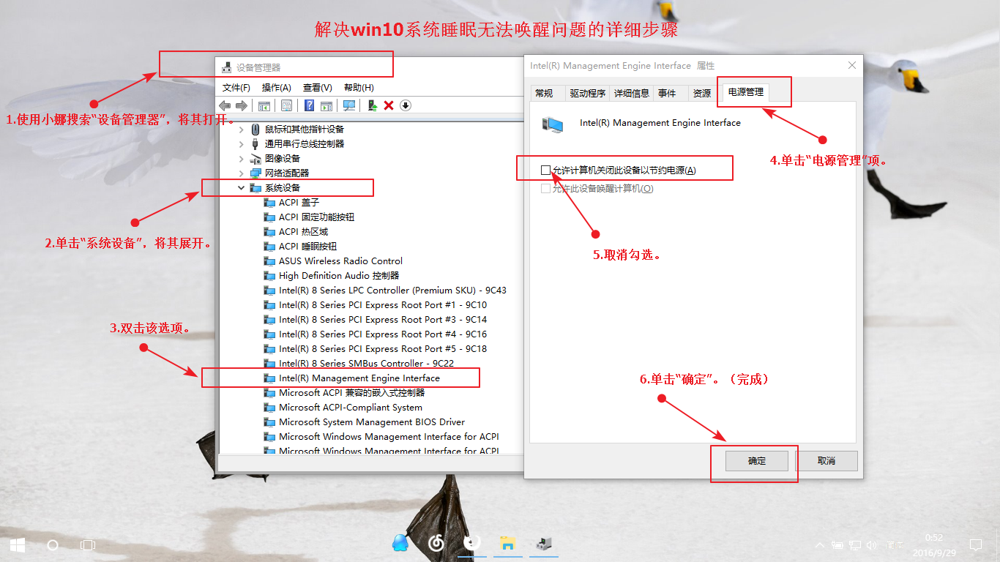

## 使用环境

> 电脑型号：戴尔 灵越15 7000系列 Inspiron 7537

---

**2018年5月8日更新，Windows 10 更新到1803后会自动更新Intel MEI到最新版本，可能会再次出现无法彻底关机或睡眠无法唤醒的情况。参照下文回滚到10.x以下版本即可**

---

## 前言

软粉报道！我算是`Windows10`的忠实用户了，因为喜欢追求最新的体验，从首个预览版会员开始就使用`Windows10`。

我也积极的推荐给我身边的人使用`Windows10`系统，给身边的朋友装好全新的`Windows10`的系统之后，好几个朋友的电脑出现了无法完全关机的问题，我的电脑也不例外。在网上找了一些办法，最终完美解决。

不想看分析的读者可以直接跳到解决办法板块了。

## 分析

电脑无法关机，一般情况下是驱动的问题，因为驱动是相对来说接近底层的软件，直接实现对主机硬件的控制。

解决的办法网上众说纷纭，有关于显卡驱动和`Intel MEI`的居多。`Intel MEI`的全名是`Intel Management Engine Interface`，中文叫英特尔管理引擎接口。用于高级的硬件管理技术，一般企业中用得多。`Intel MEI`目前的最新版本是11.x，在2015年开始发布的版本，在官方介绍中是唯一支持`Windows10` 的版本，也就是说在10.x及以前的版本官方介绍中都不提及对`Windows10`的支持。

**然而这次问题就是出现在了11.x的版本上。**

得益于`Windwos10`的自动安装和升级驱动，我们在重新安装了`Windows10`系统之后，只要连接上网络，系统会自动下载驱动程序以及升级补丁包进行安装，使得省去了额外的很多操作。在自动安装驱动的时候，`Windows10`默认下载安装`Intel MEI 11.x`版本，而这个驱动版本就是导致无法正常关机的罪魁祸首。

## 解决办法

分析完了，说一下两种解决办法。

### 办法（一）

虽然`Intel MEI 10.x`及以下版本官方介绍中并没有提及`Windows10`条目，但是不影响我们对于驱动的安装，所以我们需要下载低版本的`Intel MEI`驱动程序进行安装。

> **下载驱动程序注意事项：**
>
> 1. 最好从官网下载程序，但是如果在官网页面`Windows10`条件下找不到`Intel MEI 10.x`的驱动程序，可以将搜索条件切换到`Windows8`后再查找；
> 2. 尽量少用驱动精灵一类的一建管理驱动软件，尤其是在更新主板等极其容易导致电脑无法开机的驱动时，很容易导致无法开机。这些都是血的教训啊；
> 3. 选用10.x及以下的驱动程序时，尽量还是选用新一点的10.x，在安装`Intel MEI 9.x`版本的时候，弹出了兼容性提示；
> 4. 如果确实无法找到，可以去我提供的链接去找找（[下载链接](http://drivers.mydrivers.com/drivers/491_196594.htm)｜[驱动目录](http://drivers.mydrivers.com/search-5-490/h21165-0-0-1-0-1.htm)）

下载好了直接点击安装即可，如果出现无法安装或者安装出错，请到任务管理器中先手动将Intel Management Engine Interface卸载。卸载的具体步骤如下

> 设备管理器 > 系统设备 > Intel Management Engine Interface  > 右键卸载驱动

### 方法（二）

这个方法我是在知乎上面找到的，有的人也用此解决了这个问题。

但是有的电脑驱动中没有提供这个选项，至少我的电脑没有这个选项。

**具体操作如下：**

