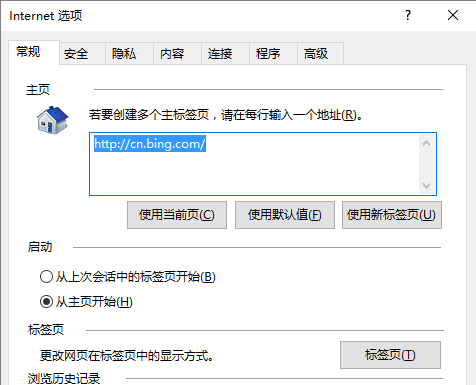
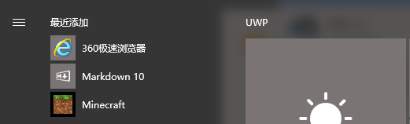
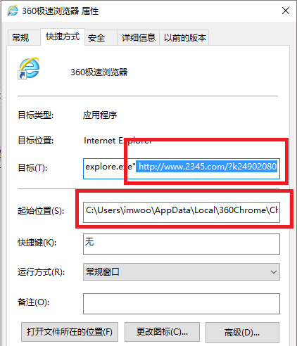
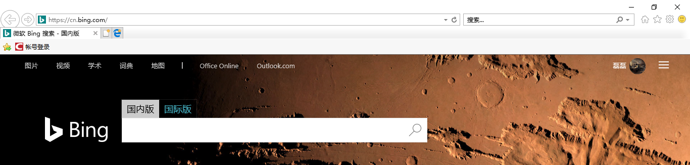

这两天想重温一下以前玩过的单机游戏，然后在我个人觉得还信得过的游戏论坛上找了一个，安装的时候小心翼翼，结果安装之后装上了一堆臭流氓软件，而且主页也被修改了。

喜欢简洁纯净的我哪能容忍这些操作，于是气愤的将游戏和一堆附加软件给卸载了，然后开始了修改回IE主页的操作...

## 操作步骤

### 排查一：查看IE浏览器的默认主页

> IE浏览器 > 工具 > Internet选项 > 常规

这里的必应`https://www.bing.com/`确实是我自行设定的默认主页，浏览器主页并未被修改，看起来一切正常。

### 排查二：定位到IE浏览器属性

我打开我的开始菜单，发现我的IE浏览器怎么改名为360浏览器了。

右键查看`360极速浏览器`的属性

#### 猫腻之处

异常的地方有两个

1. IE浏览器的目标文件后面接了2345主页的网址，这样的意思不就是调用这个快捷方式，然后调用IE浏览器打开这个网址嘛；
2. 其次位置定位到了我之前安装的360极速浏览器上面，因为改为用谷歌Chrome了，所以这次就把360极速浏览器给卸载了。

#### 解决方法

1. 将属性-目标中的网址删除，另外因为我电脑上没有360Chrome了，所以我将起始位置中的内容也一并删除了，然后点击确定保存就行了；
2. 检查一下电脑上的其它浏览器（比如说我的Chrome浏览器，虽然打开正常，但是依旧被修改了），修改方法类似；
3. 在开始菜单中存在出现的新的浏览器快捷方式，点击右键删除即可（不是卸载，因为我们是删除使用浏览器打开指定网页的快捷方式，而不是卸载浏览器）

#### 修改效果

