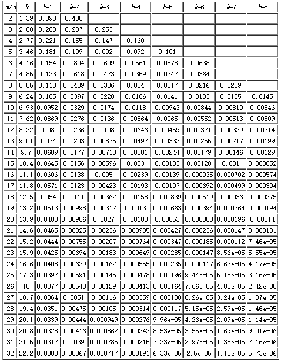

# 数据如何去重

以用户唯一标识`uid`为例，千万级以上的用户规模，如何判断某一个用户是否已经存在？

## 常见去重方案

假设用户量级约 1 亿，即 10 ^ 8 个用户`uid`，且`uid`字符串长度不可控。

1. 利用数据库唯一性索引

   如 MySQL `primary key`、`unique key`。但是往往会涉及磁盘的持久化，导致读写效率底下。

2. 基于内存的哈希表（HashSet、HashMap）

   为了解决第 1 点中读写效率问题，直接将`uid`添加至 Set 中，基于内存+复杂度 O(1)，使得读写效率高。

   但是`uid`字符串长度不可控，如`uid="MS4wLjABAAAAlwXCzzm7SmBfdZAsqQ_wVVUbpTvUSX1WC_x8HAjMa3gLb88-MwKL7s4OqlYntX4r"`，该 uid 约 75 个字符串，其中`uid`字符串全以 ASCII 码组成。`uid`长度以 75 个字符来计算，一个`uid`至少占用 75 个字节（忽略集合中的`hash(obj)`等其它内存消耗），将会占用约 7GB 左右内存。如果`uid`是更长的字符串或者去重对象为中文等单个字符占用多个字节的字符串，将会占用更多内存资源。

3. 经摘要算法后再去重（MD5、SHA1、SHA512）

   为了解决第 2 点中的去重对象占用资源过大，空间利用率不高的问题，可加入哈希算法将任意长度字符串转换成一个固定长度的字符串。

   以 MD5 摘要算法为例，计算第 2 点中相同的`uid`的 MD5 哈希值。

   ```python
   import hashlib

   md5 = hashlib.md5()

   uid = "MS4wLjABAAAAlwXCzzm7SmBfdZAsqQ_wVVUbpTvUSX1WC_x8HAjMa3gLb88-MwKL7s4OqlYntX4r"
   md5.update(uid.encode())

   # hexdigest()返回的是十六进制的字符串表达形式
   uid_hex = md5.hexdigest()

   >>> uid_hex = "27f8298a7c8d148a815d1084cd289374"
   ```

   通常计算结果`uid_hex`以一个 32 个字节的 16 进制字符串表示，即经过哈希计算后只占用空间为 128bit，单个哈希占用内存 16 个字节。10^8 个用户`uid`将占用内存约 1.5GB，虽然相比第 2 点内存占用减少了 78%。但是内存占用较多。

4. BitMap 算法，通过 bit 位来映射对象的状态

   申请一段给定长度 bitmaps，如果 `hash(uid)` 的结果为 0829，则将 bitmaps 的第 0829 位状态置为 1，表示该`uid`已经存在。

   使用 BitMap 算法可以节省大量的内存，但是单一的哈希函数发生冲突的概率太高。

## BitMap

Bit（位）- Map（图）

基本原理是使用一个比特 bit 位来映射某个元素的状态，由于一个比特位只能表示 0 和 1 两种状态，通常用于判断该元素的是与否状态，如用户是否存在。

### 优势

1. 单个状态只占用一个 bit，非常省空间；
2. 读写某一状态位时操作时间复杂度为 O(1)，操作效率高；

### 劣势

1. 一个 bit 位表示的信息有限，只有 0 和 1 两种状态；
2. 读取某段状态位操作时间复杂度为 O(n)；

### 示例

以 Redis BitMap 为例，

> Redis 其实只支持 5 种数据类型，并没有 BitMap 这种类型，BitMap 底层是基于 Redis 的字符串类型实现的。同时也受到动态字符串最大长度 512M 的限制。
> Redis 中 BitMap 的基础操作 SETBIT 和 GETBIT 是在 Redis version ≥ 2.2.0 提供的。

需要记录和查询某一用户`uid=”leowoo”`过去一年中的签到情况。

```bash
# SETBIT key offset value
# 用户leowoo在2021-01-01等多个日期进行了签到
SETBIT leowoo 20210101 1
SETBIT leowoo 20210829 1
SETBIT leowoo 20210918 1

# BITCOUNT key [start end [BYTE|BIT]]
# 用户leowoo累计签到次数
BITCOUNT leowoo
# 用户leowoo在2021年度的签到次数
BITCOUNT leowoo 20210101 20211231
```

一年以 365 天，一个用户的统计情况将占用 365 bits，即 45.6 Bytes，占用内存资源极低。

# 布隆过滤器

## 描述

布隆过滤器的本质是一个 BitMap，创建布隆过滤器 bloom filter 的位数图时，会申请一个固定长度为`m`个比特位的数组 array，array 中每个 bit 位都被初始化为 0。

与上面提到的 BitMap 去重方法类似，不过为了减少单一的哈希函数带来的哈希冲突，布隆过滤器中加入了`k`个哈希函数，并且每个哈希函数的输出结果`i`在 `0～m-1` 之间，因为需要将结果 i 映射到 array 的第 i 位上，并且将第`i`位置为 1。

布隆过滤器是一个空间效率高的概率型数据结构，可以用来判断一个元素**一定不存在**或者**可能存在**。

### 关键指标

- m：bit 位个数（即容量）
- k：哈希函数的个数
- n：用于去重的数据规模
- p：误判率

### 优势

1. 空间效率高，占用空间小。
2. 插入和查询效率高，读写时间复杂度均为 O(k)。

### 劣势

1. 存在一定误判率，但误判率是可控的。如果判断元素不存在，则一定不存在；如果元素存在只是很可能存在。
2. 不能包含数据本身内容。
3. 不支持或较难实现删除的功能。

## 计算

布隆过滤器提升准确率的两个姿势：

1. 适当增加哈希函数，增大随机性，减少哈希碰撞的概率。
2. 扩大数组范围，使 hash 值均匀分布，进一步减少 hash 碰撞的概率。



### 误判率 p

误判率 p 受三个因素影响：bit 位的容量 m，哈希函数的个数 k，数据规模 n

误判率计算公式：

$$ p=\left(1-e^\frac{-kn}{m}\right) $$

### bit 位数 m

已知误判率 p，数据规模 n，则 bit 位数 m 可以通过以下公式计算得到：

$$ m=-\frac{nlnp}{{(ln2)}^2} $$

### 哈希函数个数 k

$$ k=\frac{m}{n}ln2 $$

### 示例

假设需要去重的样本数$n=10^8$，期望误判率为万分之一$p=0.0001$。

通过上述公式计算得到

```python
from math import log, ceil

n = 10 ** 8
p = 0.0001

# 根据公式 m=-n*lnp/(ln2)^2 获取bit位数
# m=1917011676
m = ceil((n * log(p)) / log(1 / pow(2, log(2))))
# 根据公式 k=m/n*ln2 获取哈希函数个数
# k=13
k = round((m / n) * log(2))
```

各项参数关系坐标图如下

1. 误判率 p 与样本容量 n 关系

   

2. 误判率 p 与容量位数 m 关系

   

3. 误判率 p 与哈希函数 k 关系

   

## 代码实现

### 使用 Python `bitarray` 实现

```python
from math import ceil, log

import mmh3
from bitarray import bitarray

class BloomFilter:
    """布隆过滤器实现基类"""

    def __init__(self, n: int, p: float):
        """
        Args:
            n: 需要去重的元素规模数
            p: 误判率
        """
        self.n = n
        self.p = p
        # 根据公式 m=-n*lnp/(ln2)^2 获取bit位数
        self._m = ceil((n * log(p)) / log(1 / pow(2, log(2))))
        # 根据公式 k=m/n*ln2 获取哈希函数个数
        self._k = round((self._m / n) * log(2))
        # bitarray
        self.bitarray = self.new_bitarray()

    @property
    def bit_size(self):
        """容量bit位数"""
        return self._m

    @property
    def hash_cnt(self):
        """hash 函数个数"""
        return self._k

    def hash_point(self, item):
        """获取元素通过 hash 函数返回的哈希值，
        并与当前数组长度求余，得到该元素在过滤器中的 hash_cnt 个点
        """
        return [mmh3.hash(item, i) % self.bit_size for i in range(self.hash_cnt)]

    def new_bitarray(self):
        """创建bitarray"""
        array = bitarray(self._m)
        # 起始位置0
        array.setall(0)
        return array

    def add(self, item):
        """添加元素"""
        points = self.hash_point(item)
        for p in points:
            self.bitarray[p] = 1

    def exist(self, item) -> bool:
        """是否存在元素"""
        points = self.hash_point(item)
        for p in points:
            if not self.bitarray[p]:
                return False
        return True
```

### 使用 Python + Redis BitMap 实现

```python
from math import ceil, log

import mmh3
import redis as redis

class BloomFilter:
    """布隆过滤器实现基类"""

    def __init__(self, n: int, p: float, bf_key: str, redis_conn: redis.Redis):
        """
        Args:
            n: 需要去重的元素规模数
            p: 误判率
            bf_key: bloom filter key
            redis_conn: redis client connection
        """
        self.n = n
        self.p = p
        # 根据公式 m=-n*lnp/(ln2)^2 获取bit位数
        self._m = ceil((n * log(p)) / log(1 / pow(2, log(2))))
        # 根据公式 k=m/n*ln2 获取哈希函数个数
        self._k = round((self._m / n) * log(2))
        self.bf_key = bf_key
        self.redis = redis_conn

    @property
    def bit_size(self):
        """容量bit位数"""
        return self._m

    @property
    def hash_cnt(self):
        """hash 函数个数"""
        return self._k

    def hash_point(self, item):
        """获取元素通过 hash 函数返回的哈希值，
        并与当前数组长度求余，得到该元素在过滤器中的 hash_cnt 个点
        """
        return [mmh3.hash(item, i) % self.bit_size for i in range(self.hash_cnt)]

    def add(self, item):
        """添加元素"""
        points = self.hash_point(item)
        for p in points:
            self.redis.setbit(self.bf_key, p, 1)

    def exist(self, item) -> bool:
        """元素是否存在"""
        points = self.hash_point(item)
        for p in points:
            if not self.redis.getbit(self.bf_key, p):
                return False
        return True
```

# 巨人的肩膀

1. 博文：[爬虫如何去重？](http://jayden5.cn)
2. 博文：[布隆过滤器](http://ruanhao.cc/blog/bloom_filter.html)
3. 博文：[Python-布隆过滤器](https://www.cnblogs.com/yscl/p/12003359.html)
4. 工具：[Bloom filter calculator](https://hur.st/bloomfilter/)
5. 文档：[Redis 官网 SETBIT](https://redis.io/commands/SETBIT)
6. 博文：[Redis 中 BitMap 的使用场景](https://www.cnblogs.com/54chensongxia/p/13794391.html)
7. 博文：[BitMap 的原理以及运用](https://www.cnblogs.com/dragonsuc/p/10993938.html)
