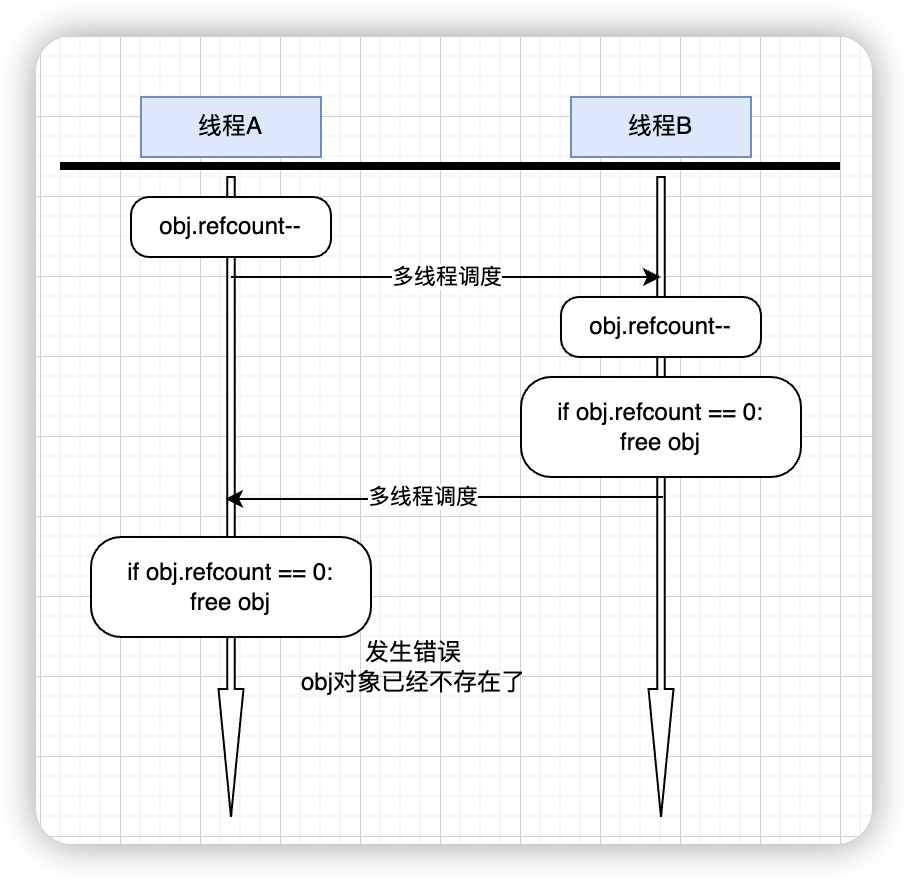

# 全局解释器锁 GIL

Python 中通过`GIL（Global Interpreter Lock）`这种互斥锁（`mutual-exclusion lock, mutex`）来防止 CPython 的多线程环境中受到干扰。

因为在这种环境下，一条线程有可能突然打断另一条线路抢占程序的控制权。如果这种抢占行为来得不是时候，那么解释器的状态（如垃圾回收的引用计数）就会遭到破坏。

> 我们可以通过如下方式来获取 Python 程序中对象`obj`的引用数
>
> ```python
> import sys
>
> sys.getrefcount(obj)
> ```

当 Python 内某个对象的引用数为 0 时，该对象会被回收。其中回收的过程分为两步：首先判断对象引用数是否为 0，如果为 0 则回收该对象。

以下面为例，假如没有 GIL 的情况下，有线程 A 和线程 B 两个线程，都引用了同一个对象`obj`。由于没有 GIL 的存在，A 和 B 两个线程甚至可以在多核 CPU 上并行执行，忽略其它对`obj`的引用，起始情况下`obj.refcount==2`。



两个线程 A 和 B 都想撤销对`obj`对象的引用。如果线程 A 已经将`obj`对象的引用数执行减 1 操作，由于缺少 GIL，线程 B 可同时操作对象`obj`的引用数，此时线程 B 也将`obj`对象的引用数减 1。若线程 B 先判断对象`obj`的引用数已经变为 0，则直接删除了对象`obj`。随后线程 A 恢复了调度以及线程上下文继续往下执行，判断对象`obj`的引用数时，发现对象`obj`已经不存在了，则会发生错误。

**GIL 的好处**：简化了 Python 对共享资源的管理

---

# 线程安全与线程锁

全局解释器锁 GIL 保证了 CPython 解释器在某一时刻只有一个线程在执行，但并不能保证线程在何时切换，不恰当的线程切换可能会对我们程序运行产生期望之外的结果。

## 线程安全

### 什么是线程安全

1. 线程安全是指某个函数、函数库在多线程环境中被调用时，能够正确地处理多个线程之间的**共享变量**，使程序能够正确完成；

2. 由于线程的执行随时会发生切换，就造成了不可预料的结果，出现了线程不安全。

   > Python 线程切换描述可以看看官方文档，包括何时切换、切换间隔、设定自定义的切换间隔、线程切换 Python2 对比 Python3 的区别等
   > https://docs.python.org/3/library/sys.html#sys.setswitchinterval

### 线程不安全示例

#### 示例一

我们创建了 5 个线程来执行函数`add_count`，每个线程都对全局变量`count`进行 1000000 次加 1 操作，所以累计运行 5000000 次对`count`加 1 的操作。

如果正确的运行得到`count`的结果为 5000000，但实际上我们得到的`count`是一个小于等于 5000000 的值，与我们的期望值不一致，发生了线程不安全现象。

```python
import threading

count = 0


def add_count():
    global count
    for _ in range(1000000):
        count += 1


# 创建了5个线程
ths = [threading.Thread(target=add_count) for _ in range(5)]

for th in ths:
    th.start()
for th in ths:
    th.join()

print("out:", count)  # count 值会小于等于期望的5000000

"""
out: 1713528
"""
```

分析造成的线程不安全的原因，其中`count+=1`这一步操作可以拆分为两步。

```python
temp = count + 1 # 第 1 步
count = temp	# 第 2 步
```

若某线程 A 在执行完第一步时发生了线程切换，此时临时变量`temp`会保存到该线程的上下文中，此后别的线程也进行了类似的操作。当该线程 A 拿到再次拿到 GIL 后，从上下文中取出`temp`，执行第二步把`temp`赋值给`count`的操作。赋值操作相当于直接修改了`count`的值，忽略了其它线程对`count`对象的加 1 的操作，就出现了`count`的结果值总是小于等于我们的期望值 5000000 的现象。

#### 示例二

声明了一个账户类`Account`，该类对象具有取钱`draw`的操作。取钱时有如下判定，余额充足则取钱成功，余额不足则取钱失败，所以剩余余额无论如何不应是一个负数。

```python
import threading
import time


class Account:

    def __init__(self, balance: int):
        self.balance = balance  # 资产


def draw(account: Account, amount: int):
    """取钱操作"""
    if account.balance >= amount:
        # time.sleep(0.01)  # 模拟一个IO阻塞来引起线程切换
        account.balance -= amount
    else:
        print(f'{threading.current_thread().name}: 余额不足，取钱失败')


my_account = Account(1000)
ths = [threading.Thread(target=draw, args=(my_account, 800)) for _ in range(2)]
for th in ths:
    th.start()
for th in ths:
    th.join()
print(f'余额: {my_account.balance}')

"""
运行结果
Thread-2: 余额不足，取钱失败
余额: 200
"""
```

我们实例化一个有余额 1000 的`Account`对象，创建了两条线程每条线程执行一次取钱 800 操作。正常情况下其中一条线程会因为余额不足而取钱失败。

从运行结果来看，貌似没有什么问题。但是我们在判定余额和取钱操作之间加入了一行代码`time.sleep(0.01)`来认为制造一个 IO 阻塞引起线程切换，此时我们的执行结果就会变成这样。这与我们所期望的账户余额不能为负数的结果不一样。

```python
"""
余额: -600
"""
```

**这两个示例都说明了，由于线程的切换无法预料，会引起程序结果的不正确。无论是 Python 本身执行的让线程实现并发的调度，还是人为制造的 IO 引起的线程切换都会引起线程不安全。**

### 如何判断线程不安全

**原子操作（Atomic Operation）**：指不会被线程调度机制打断的操作，这种操作一旦开始，就一直运行到结束，中间不会切换到其他线程。它有点类似数据库中的**事务**

#### `dis.dis` 查看 Python 程序执行时的字节码操作

> CPython 分两步执行 Python 程序
>
> 1. 解析源代码文本，将其编译成字节码（`bytecode`），字节码是一种底层代码。Python 采用基于栈的解释器来运行字节码；
> 2. 字节码解释器在执行 Python 程序的过程中，必须确保相关的状态不受干扰，所以 CPython 会采用 GIL 的机制来保证这一点。

我们以上述示例中提及的给一个整型对象**加 1**的操作，来看看该操作下的字节码是如何操作的：

```python
count = 0

def add_count():
    global count
    count += 1

if __name__ == '__main__':
    from dis import dis

    dis(add_count)
"""
  6           0 LOAD_GLOBAL              0 (count)  # 加载全局变量count
              2 LOAD_CONST               1 (1)      # 加载常量 1
              4 INPLACE_ADD                         # 执行加1操作，即 temp = count + 1
              6 STORE_GLOBAL             0 (count)  # 保存至全局变量，即 count = temp
              8 LOAD_CONST               0 (None)   # 加载常量 None
             10 RETURN_VALUE                        # 返回None，即Python方法若没有显式返回对象则返回None
"""
```

首先引起线程安全问题是因为多线程对共享变量的改动导致的，由此可知只有写操作才会引起线程不安全，读操作是不会有问题的。通过字节码反汇编得出的流程可以看到，存在两个写操作`INPLACE_ADD`和`STORE_GLOBAL`。

如果在`INPLACE_ADD`和`STORE_GLOBAL`两个操作之间发生了线程切换，就会出现线程不安全问题。

#### 常见的线程安全与不安全操作

`L`、`L1`、`L2` 是列表，`D`、`D1`、`D2` 是字典，`x`、`y` 是对象，`i`，`j `是 `int `变量

1. 线程安全

   ```python
   L.append(x)
   L1.extend(L2)
   x = L[i]
   x = L.pop()
   L1[i:j] = L2
   L.sort()
   x = y
   x.field = y
   D[x] = y
   D1.update(D2)
   D.keys()
   ```

2. 线程不安全

   ```python
   i = i+1
   L.append(L[-1])
   L[i] = L[j]
   D[x] = D[x] + 1
   ```

### 使用线程锁解决线程安全问题

#### `Threading.Lock()`使用姿势

```python
import threading

lock = threading.Lock()

lock.acquire() # 上锁
lock.release() # 释放锁
lock.locked() # bool 查看当前线程锁状态
```

以 `Threading.Lock()`为例，线程锁的使用过程中重复的`acquire()`和`release()`会引起线程`block`或引发`RuntimeError`异常。所有可以使用下面模式来使用线程锁。

1. **`try-finally`模式**

   ```python
   import threading

   lock = threading.Lock()

   lock.acquire()  # 加锁
   try:
       print('do something')
   finally:
       lock.release()

   ```

2. **`with`模式**

   ```python
   import threading

   lock = threading.Lock()

   # 可以观察到 Lock 类中
   # __enter__ 会执行 lock.acquire()
   # __exit__ 会执行 lock.release()
   with lock:
       print('do something')
   ```

#### 使用线程锁重回示例

我们给上面的线程不安全的程序加上线程锁，再来看看其执行的字节码是怎样的。

```python
import threading

count = 0
lock = threading.Lock()


def add_count():
    global count
    with lock:	# 加上线程锁
        count += 1


if __name__ == '__main__':
    from dis import dis

    dis(add_count)

"""
执行结果：
  9           0 LOAD_GLOBAL              0 (lock)
              2 SETUP_WITH              14 (to 18)  # 上锁 acquire
              4 POP_TOP

 10           6 LOAD_GLOBAL              1 (count)
              8 LOAD_CONST               1 (1)
             10 INPLACE_ADD
             12 STORE_GLOBAL             1 (count)
             14 POP_BLOCK
             16 BEGIN_FINALLY
        >>   18 WITH_CLEANUP_START                   # 释放锁 release
             20 WITH_CLEANUP_FINISH
             22 END_FINALLY
             24 LOAD_CONST               0 (None)
             26 RETURN_VALUE
"""
```

看起来多了更多写操作，如`POP_TOP`、`POP_BLOCK`等。 但是 `2 SETUP_WITH              14 (to 18)` 将步骤 2-18 标定成为了一个原子操作，即在 2-18 这些操作中不允许发生线程切换，此时就保证了`count += 1` 运算的安全。

---

# 参考

1. [Python 官方文档—global interpreter lock -- 全局解释器锁](https://docs.python.org/zh-cn/3/glossary.html#term-GIL)
2. [Python 字节码反汇编器](https://docs.python.org/zh-cn/3/library/dis.html)
3. [threading --- 基于线程的并行](https://docs.python.org/zh-cn/3.8/library/threading.html)
4. [通俗易懂：说说 Python 里的线程安全、原子操作 ](https://www.cnblogs.com/wongbingming/p/12892927.html)
