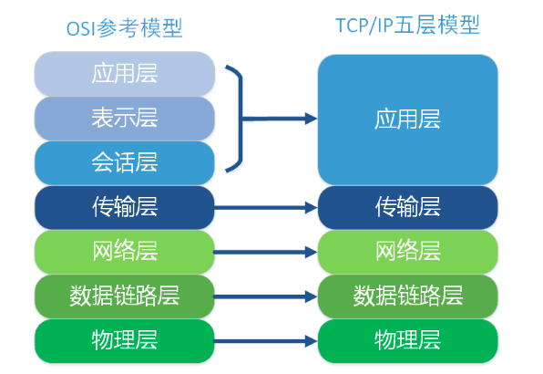
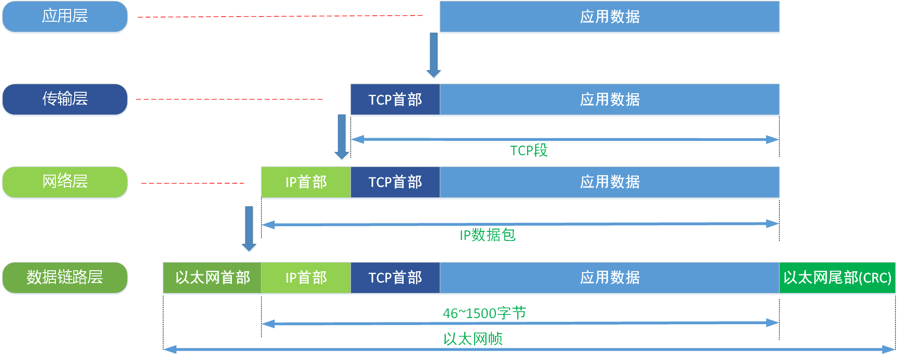

# 前言

这是偏向入门的描述路由交换转发的博文。

主要分为三个部分：部分网络知识概念、交换机转发流程、路由器转发流程。

# 概念

首先是一些枯燥的概念，了解一些基本的概念、名词，对后面路由交换的过程会有更好地理解。

## 网络分层

通常按照功能、协议来进行分层。有 OSI 七层模型、TCP/IP 对等五层模型、TCP/IP 标准模型等。



其中关于网络模型的功能介绍可以参考 WIKI：[OSI 参考模型](https://zh.wikipedia.org/wiki/OSI%E6%A8%A1%E5%9E%8B)、[TCP/IP 模型](https://zh.wikipedia.org/wiki/TCP/IP%E5%8D%8F%E8%AE%AE%E6%97%8F)

**网络模型的一些补充如下**

1. 部分层功能

   - 物理层：物理层是通信过程的基础，关注的是单个`0`和单个`1`的发送、传输和接受。
   - 数据链路层：相比于物理层，它实现的事有内在结构和意义的一连串的`0`和`1`的发送和接受。着重的是相邻两个节点、局部性的直接传递（不跨越路由节点）。局域网技术便是聚焦在数据链路层及其下面的物理层。
   - 网络层：与数据链路层对比，实现的是任意两个节点之间的、全局性的数据传递（跨越路由节点）。

2. 各层数据单元常规叫法（TCP/IP 为例）

   - 物理层：比特`Bit`
   - 数据链路层：帧`Frame`
   - 网络层：分组或包`Packet`
   - 传输层：TCP-段`TCP Segment`、UDP-报文`UDP Datagram`
   - 应用层：报文`Datagram`

3. 路由交换主要涉及数据链路层（局域网-交换机）和网络层（任意节点-路由器）两层，所以接下来主要针对这两层的运行流程做一个阐述。

   

4. 网络分层数据是如何封装的。应用层产生的数据（如一个 HTTP 请求）报文，自上而下经过每一个分层时，会加上各层的头部信息。

   

## 以太网

### 以太网帧中的 MAC 地址

查看计算机`Linux`下某一张网卡的 MAC 地址

```shell
~ ip add show ens3 | grep ether
link/ether 52:54:00:cd:bf:36 brd ff:ff:ff:ff:ff:ff
```

MAC（Medium Access Control 媒体访问控制）地址：控制在往媒体上发数据的时候，谁先发、谁后发的问题，防止发生混乱（来自极客时间/趣谈网络协议/第 5 讲）。

理论上一张网卡的 MAC 地址是全球唯一性的（实际上在缓存中也可以修改）。

**OUI（Organizationally-Unique Identier）**

制造商在网卡生产制造之前，必须先向 IEEE（美国电气和电子工程师协会）注册，以获取到一个长度为 24bit 的厂商代码，即 OUI。生产网卡时会在每块网卡的 ROM 中烧入一个 48bit 的 BIA（Burned-In Address，固化地址）。前三个字节即为该制造商的 OUI，后面三个字节由制造商自行决定。

> 关于 IEEE 给各设备制造商 OUI 的分配信息，可以在这个页面查询到
>
> http://standards-oui.ieee.org/oui/oui.txt


需要注意的有两点：

1. 烧写入网卡的 BIA 地址是不能修改的，只能读取；
2. OUI 的第一个字节的最低位一定是 0；
3. BIA 地址只是 MAC 地址的一种，具体来说是一个单播 MAC 地址，关于 MAC 地址的分类，下文会提及；

MAC 地址的分类与格式

- 单播 MAC 地址：第一个字节最低位为 0 的 MAC 地址（一张特定网卡）；

  

- 组播 MAC 地址：第一个字节最低位为 1 的 MAC 地址（一组网卡）；

  

- 广播 MAC 地址：每一个比特都是 1 的 MAC 地址，广播是组播的一个特例。

  

以上面使用命令行查看的 MAC 地址`52:54:00:cd:bf:36`为例，从第一个字节`00110110`可以看到最后一位为`0`，验证了上面所说的 BIA 是 MAC 地址中的单播地址的要点。


> 题外话：如果有业务开发需求需要伪造设备 MAC 地址参数，则一定要是一个 MAC 单播地址

### Ethernet II 格式


**Ethernet II 格式的以太帧各字段描述：**

- 目标 MAC：表示接收者的地址，可以是单播、组播、广播地址；
- 源 MAC：发送者的地址，只能是一个**单播 MAC**地址；
- 类型：IP 数据报`0800`、ARP 请求`0806`、MPLS 报文`8848`等；
- CRC：用于对帧进行检错校验；
- 以太帧根据目的 MAC 地址不同可分为三种类型：
  - 单播帧：目的 MAC 地址为一个单播 MAC 地址的帧；
  - 组播帧：目的 MAC 地址为一个组播 MAC 地址的帧；
  - 广播帧：目的 MAC 地址为一个广播 MAC 地址的帧；

# 参考

1. 华为《HCNA 网络技术学习指南》
2. 极客时间《趣谈网络协议》：https://time.geekbang.org/column/article/8094
