# 环路问题

在交换机构成的局域网网络中，时常为了减少单链路的故障，增加网络可靠性。交换网络中通常会增加冗余链路。

以下图为例，当交换机 S1 和 S2 之间不存在链路时，PC1 向 PC2 发送数据帧，只能通过`PC1→S1→S2→S3→PC2`这一条单链路。如果 S1-S2 或 S2-S3 中任意一个链路出现故障时，就会导致数据帧不可达。

当 S1-S3 这条链路建立后，PC1 发送数据帧至 PC2 就有两条链路可走，分别是`PC1→S1→S2→S3→PC2` 和`PC1→S1→S3→PC2`，提高了网络的可靠性。

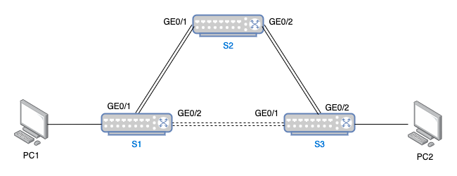

在建立了`S1-S3`这条链路后就形成了网络环路，环路是可以提高网络连接的可靠性的，同时也会带来一系列的问题。比如 MAC 地址表翻摆、广播风暴、多帧复制等

- **MAC 地址表翻摆**：大量消耗交换机处理资源，甚至交换机瘫痪；
- **广播风暴**：产生大量的广播帧，计算机收到广播帧后会将广播帧的载荷数据上送给网络层处理，可能导致计算机瘫痪；
- **多帧复制**：环路中若存在两台交换机有目的 PC 的 MAC 表，然后若一个单播帧被泛洪到了这两个交换机中，则目的 PC 会收到两个数据帧的拷贝。

假如 PC1 发起了一个广播帧，进入到交换机 S1 后，交换机 S1 收到广播帧后会直接进行泛洪操作，数据帧进入交换机 S2 和 S3，交换机 S2 和 S3 收到这个广播帧后也会直接进行泛洪操作。这个广播数据帧会在这个环路中**顺时针**+**逆时针**反复运动。于交换机而言，三个交换机的 MAC 表快速翻摆，消耗交换机处理资源甚至瘫痪；于接入的计算机而言，计算机收到广播帧后都会将该数据帧交给上层网络层去处理，大量的广播帧形成广播风暴可能会导致计算机瘫痪。

假如 PC1 向 PC2 发起了一个单播帧，假设此时交换机 S1 的 MAC 表中没有 PC2 的记录，但 S2 和 S3 的 MAC 表有 PC2 的记录。交换机 S1 就会将该帧复制然后进行泛洪操作。交换机 S1 复制后的帧会分别通过`S1→S2→S3→PC2`和`S1→S3→PC2`两条线路到达 PC2，此时 PC2 就收到了两条来自 PC1 的数据帧，即多帧复制。

# STP 生成树协议

STP (Spanning Tree Protocol) 生成树协议，是一种由**交换机**运行的、用来解决**交换网络**中**环路**问题的**数据链路层**协议。

**两大作用：**

- **消除二层环路**：通过**阻断冗余链路**来消除交换网络中的可能存在的环路；
- **链路备份**：当活动的链路发生故障时，**激活冗余链路**，及时回复网络联通性。

**工作原理：**

- 在一个具有物理环路的交换网络中，通过在交换机之间交换 BPDU 消息来发现环路，并且有选择地阻塞某些端口，最终将自动生成一个**没有环路的树形网络结构**。
- 生成的无环路的网络结构被称为 STP 树（STP Tree）。

## STP 中的几个术语

1. **桥（Bridge）**

   可以不严谨地这样理解，早期交换机被叫做网桥（路由器被叫做网关类似）。

2. **桥的 MAC 地址（Bridge MAC Address）**

   顾名思义，即交换机的 MAC 地址。但是一个交换机是有多个端口的，每个端口都会有一个 MAC 地址。通常把交换机所有端口中编号最小的那个端口的 MAC 地址作为桥的 MAC 地址。

3. **桥 ID（Bridge Identifier，BID）**

   - 桥 ID 用于在 STP 中唯一标识一个网桥（交换机）；
   - 桥 ID = 桥优先级 + 桥 MAC 地址
     - 桥优先级，头 2 个字节，默认是 0x8000（2^15 即 32768），优先级可人为设定，范围为 0 ～ 65536，步长为 4096；
       - 值约小优先级越高；
       - 因为目前只用到了前 4bit，所以步长为 4096（2^12）;

   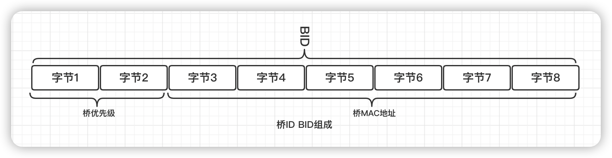

4. 端口 ID（Port Identifier，PID）

   - 端口 ID 用于在一个网桥中唯一地标识一个端口；

   - 端口 ID = 端口优先级 + 端口编号
     - 端口优先级，头 1 个字节，默认 128，普遍范围 0 ～ 240，步长为 16。

   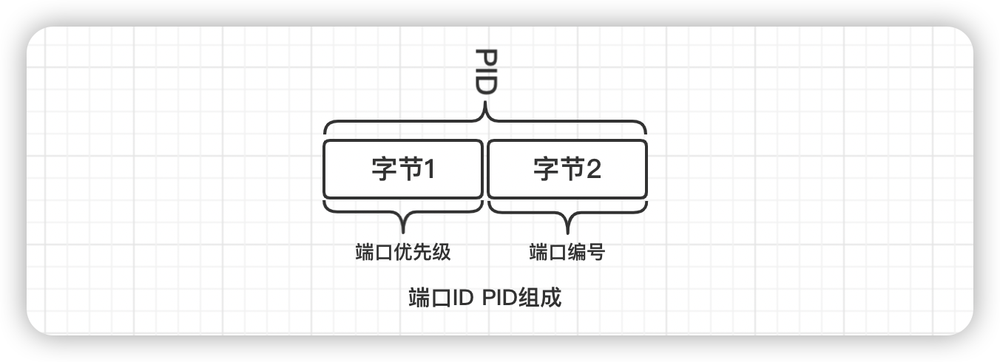

5. 路径开销（Path Cost）

   - 路径开销用于衡量路径的优劣；

   - STP 中链路开销于链路带宽成反比；

     - 根路径开销（Root Path Cost，RPC）；
       - 某个交换机的端口到根桥的累计路径开销

   - 不同的设备商采用的速率于路径开销标准可能不同。

   | 端口速率  | 路径开销（IEEE 802.1t） | 路径开销（华为） | 路径开销（华三） |
   | :-------: | :---------------------: | :--------------: | :--------------: |
   | 10Mbit/s  |         2000000         |      200000      |       2000       |
   | 100Mbit/s |         200000          |       200        |       200        |
   |  1Gbit/s  |          20000          |        20        |        20        |
   | 10Gbit/s  |          2000           |        2         |        2         |

## STP 工作流程

STP 工作流程总体分为四个步骤：

- 选举根桥
- 确定根端口
- 确定指定端口
- 阻塞备用端口

这里没有用有序列表，是因为这四个步骤在 STP 交换机工作时持续发生的事件。

BPDU（Bridge Protocol Data Unit）网桥协议数据单元是 STP 协议帧。

以下例的网络拓扑图为例，观察 STP 树的生成过程

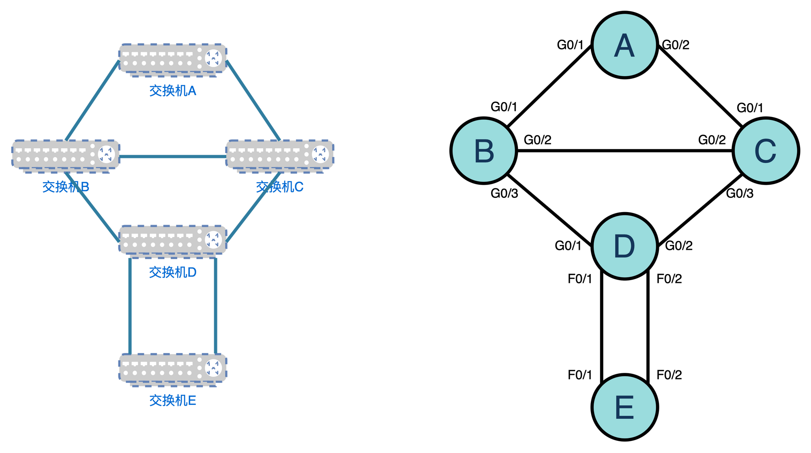

### 选举根桥

根桥是 STP 树的根节点，是整个交换网络的逻辑中心。根桥不是固定不变的，当网络的拓扑发生变化是，根桥也可能发生变化。

一个网络拓扑中的交换机（支持运行 STP 的交换机）在初始启动后都会向其它交换机发送 BPDU 宣告自己是根桥。当交换机收到其它交换机发来的 BPDU 时，会和自身的网桥 BID 做比较。通过不断交换 BPDU 最终会选出一台最小 BID 的交换机做根交换机。

根桥选举原则：

**桥 ID 最小**

选举根桥流程如下

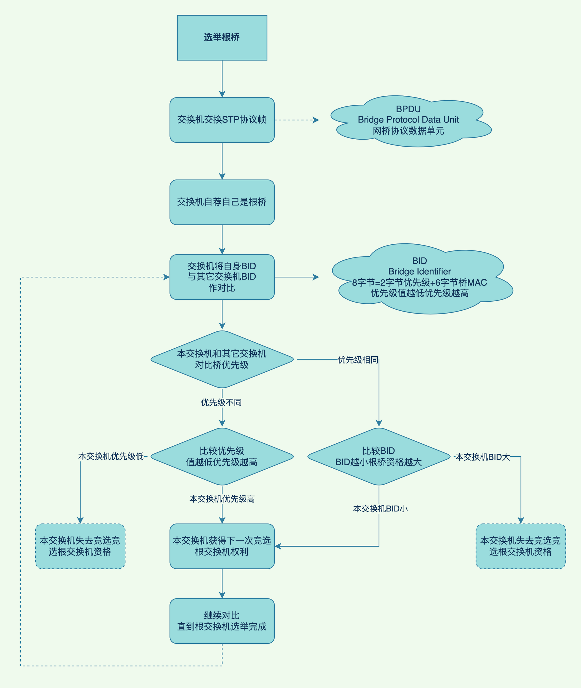

选举根桥示例如下

根据上面所说的选举原则，BID 最小的交换机会被设定为根交换机，而 BID=优先级+桥 MAC；比较 BID 的大小，即从各 BID 的高位开始比较；如`BID=32768.00-01-45-89-83-65`，则`32768→00→01→45→89→83→65`

1. 在所有 STP 交换机中，如果各 BID 中优先级不一致，则优先级数值最低（数值越低优先级越高）的那个交换机被设定为根交换机。
   1. 如果需要指定某台交换机为根交换机，则可直接将优先级设定为`0`，即设定最高优先级；
2. 若各交换机优先级一致，则需要比较其 MAC 地址；如下图所示，五个优先级一致的交换机中，交换机 A 的 MAC 最小，即 BID 最小，所以交换机 A 将会被选为根交换机。

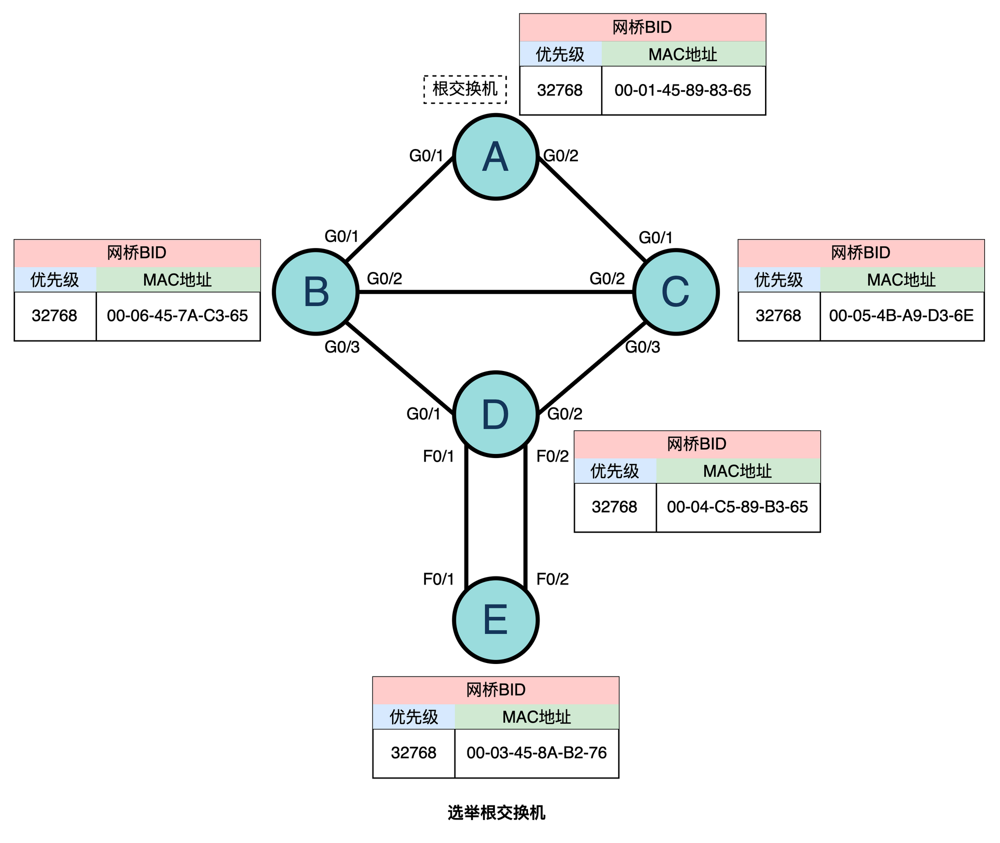

### 确定根端口（RP，Root Port）

根桥确定后，其它没有成为根桥的交换机都成为非根桥。为了保证某台非根桥设备到根桥设备的路径开销最小，需要选出一个根端口，非根交换机上的根端口用于与根桥之间进行报文交互。

一台非根交换机上最多只有一个根端口。

根端口用于接收根交换机发来的 BPDU，也用来转发普通流量。

根端口选举原则：

- 端口到根的路径开销最小
- 上行设备 BID 最小
- 上行设备 PID 最小

确定根端口流程如下

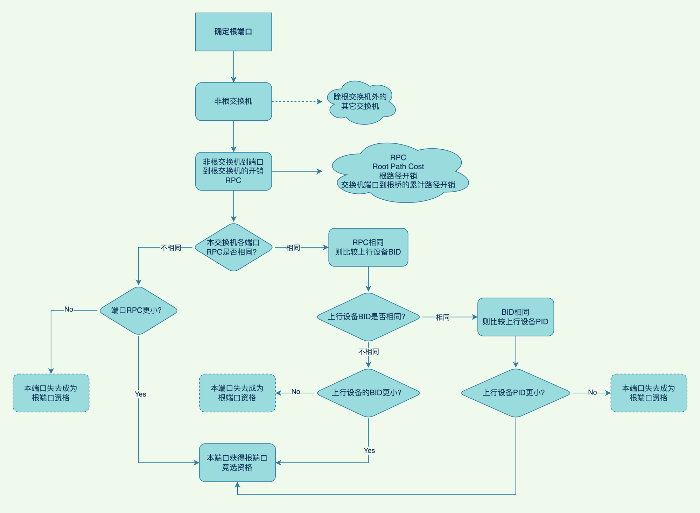

确定根端口示例如下

先给出最终的根端口（RP）的选举结果

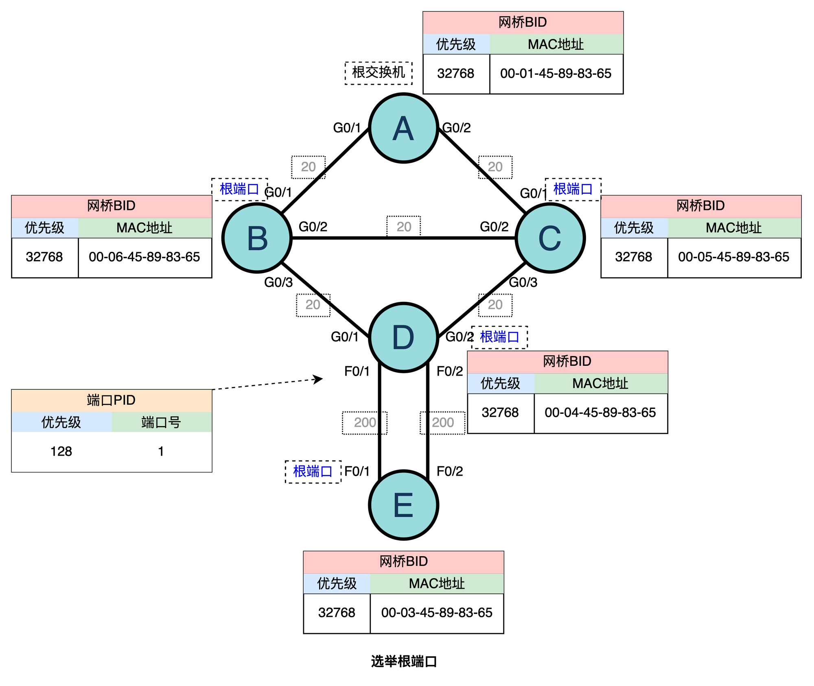

路径开销采用华为标准，各链路速率开销如下表所示

| 端口速率  | 路径开销（华为） |
| :-------: | :--------------: |
| 10Mbit/s  |      200000      |
| 100Mbit/s |       200        |
|  1Gbit/s  |        20        |
| 10Gbit/s  |        2         |

在第一步中，已经确定了交换机 A 为根交换机，所以 B、C、D、E 四个交换机为非根交换机。

现在需要在每个非根交换机上根据路径开销等条件选出一个根端口。

1. 交换机 B

   1. 交换机 B 和根交换机 A 之间是 GE 千兆链路，`RPC(B→A)=20`，`RPC(B→C→A)=40`。所以最小`B→A`链路 RPC 最小，则 G0/1 会被选为根端口。

2. 交换机 C

   1. 交换机 C 和交换机 B 同理，可以得到 G0/1 会被选为根端口。

3. 交换机 D

   1. 交换机 C 到根交换机有多条路径可达，其中`PRC(D→B→A)=40`和`RPC(D→C→A)=40`两条路径最短且花费相同；
   2. 则比较上行设备的 BID，可以得到`BID(B)>BID(C)`，即交换机 C 被选为更优先转发的设备，即交换机 D 的 G0/2 会被选为根端口。

4. 交换机 E

   1. 交换机 E 到根交换机有多条路径可达，数据帧转发至根交换机 A 时都需要经过交换机 D，所以最小花费`RPC(E→D→[B,C]→A) =  240`。交换机 E 无论端口 F0/1 还是 F0/2 的 RPC 都为 240，且一致；

   2. 则此时将比较上行设备交换机 D 的桥 BID，但两个端口 F0/1、F0/2 的上行设备都是交换机 D，所以上行设备 BID 也一致；

   3. 则比较上行设备的 PID 大小，PID 越小优先级越高

      1. 如果交换机 D 的 F0/1、F0/2 两个端口优先级不一致，则优先级越高那个端口连接的交换机 E 的端口会被选为根端口；
      2. 如果交换机 D 的 F0/1、F0/2 两个端口优先级一致，则端口号越小的那个端口连接的交换机 E 的端口会被选为根端口。

      这里假设交换机 E 的上行设备交换机 D 各端口优先级一致，则交换机 D 的`PID(F0/1)<PID(F0/2)`，即交换机 E 的端口 F0/1 的上行设备端口 PID（交换机 D 的 F0/1）更小，所以交换机 E 的端口 F0/1 会被选为根端口。

### 确定指定端口（DP，Designated Port）

当一个网段有两条以及两条以上的路径通往根桥是（该网段连接的不同的交换机，或者该网段连接了同一台交换机的不同端口），与该网段相连的交换机就要确定出一个唯一的指定端口。

指定端口用于转发根交换机发来的 BPDU，也用来转发普通流量。

指定端口选举原则：

- 所在网桥到根的路径开销最小
- 本端网桥 BID 最小
- 本端端口 PID 最小

确定指定端口流程如下

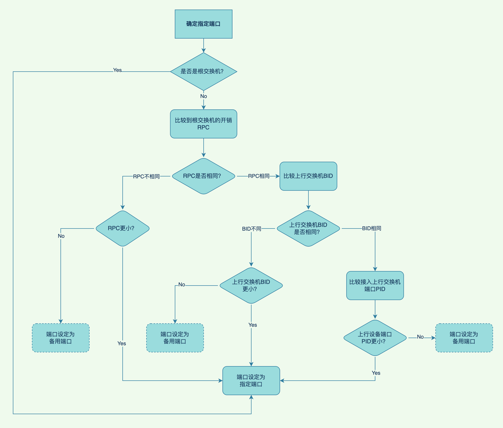

在经过确定根端口后，网络拓扑图中剩余三条链路还未解决构成的环路问题，分别是

- `B(G0/2)-C(G0/2)`
- `B(G0/3)-D(G0/1)`
- `D(F0/2)-E(F0/2)`

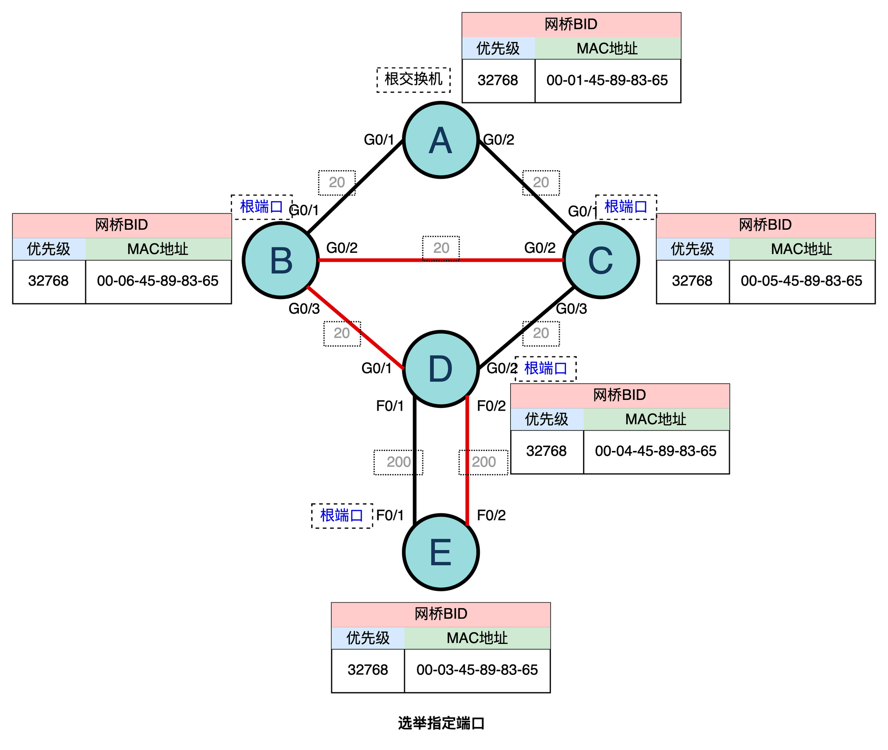

STP 树最终的目的是解决环路问题，所以需要明确每一条链路是否应该阻塞，若阻塞应该阻塞该条链路的哪一方端口。指定端口则来解决剩余的链路问题。

确定指定端口示例如下

1. 根交换机上所有端口都是指定端口；

   1. 所以根交换机 A 的所有端口都是指定端口

2. 根端口的对端端口一定是指定端口；

   1. 交换机 C 的 G0/3 端口成为指定端口
   2. 交换机 D 的 F0/1 端口成为指定端口

3. BPDU 转发端口到根交换的路径成本 RPC 最小

   1. ```
      D(F0/2)-E(F0/2)
      ```

      链路

      1. 根交换机发来数据帧要到达 D(F0/2)端口，其最短路径`RPC(A→[B,C]→D(F0/2))=40`；
      2. 根交换机发来数据帧要到达 E(F0/2)端口，其最短路径`RPC(A→[B,C]→D→E(F0/2))=240`；
      3. 端口 D(F0/2)小于 E(F0/2)的 RPC，所以该链路中 D(F0/2)被选定为指定端口；

   2. ```
      B(G0/3)-D(G0/1)
      ```

      链路

      1. 同理得出 B(G0/3)端口`RPC(A→B)=20`；
      2. 同理得出 D(G0/1)端口`RPC(A→C→D)=40`;
      3. 端口 B(G0/3)路径花费更小，故 B(G0/3)被选为指定端口

4. 本端网桥 BID 最小

   1. ```
      B(G0/2)-C(G0/2)
      ```

      链路

      1. 同上流程一致，端口 B(G0/2)的`RPC(A→B)=40`，端口 C(G0/2)的`RPC(A→C)=40`。两个端口的 RPC 一致；
      2. 当 RPC 一致时，则比较本端交换机的 BID，BID 越小则优先级越高，则优先级高的交换机所在端口被选为指定端口，即 C(G0/2)为指定端口。

所以选取完成指定端口后，网络拓扑图如下

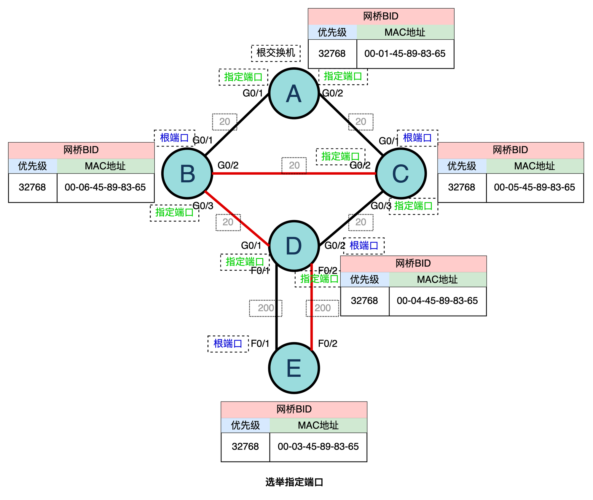

### 阻塞备用端口（AP，Alternate）

在确定了根端口和指定端口之后，交换机上所有剩余的非根端口和非指定端口统称为备用端口。

STP 协议中会将这些备用端口进行逻辑阻塞，即不再转发由终端计算机产生并发送的帧（用户数据帧），但可以继续处理 STP 协议帧。

当阻塞了备用端口后，网络拓扑图标记如下

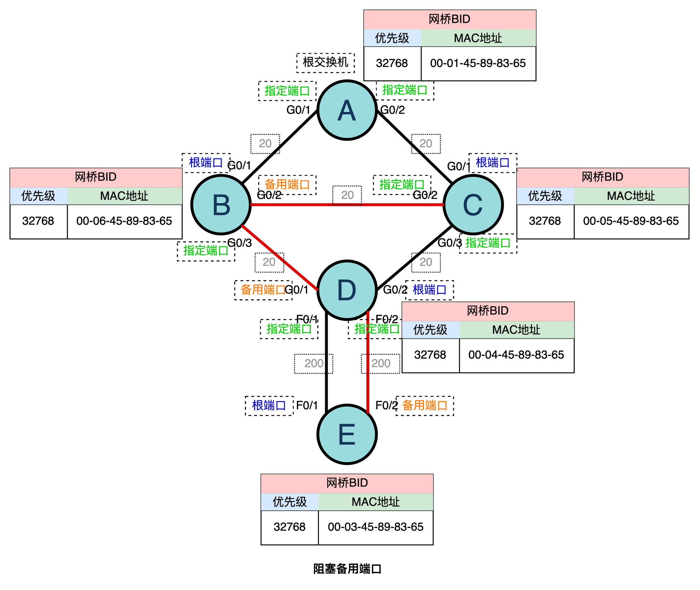

### 最终逻辑网络拓扑图

在运行完成 STP 树四个流程后，去除干扰标识，最终逻辑上的网络拓扑图如下

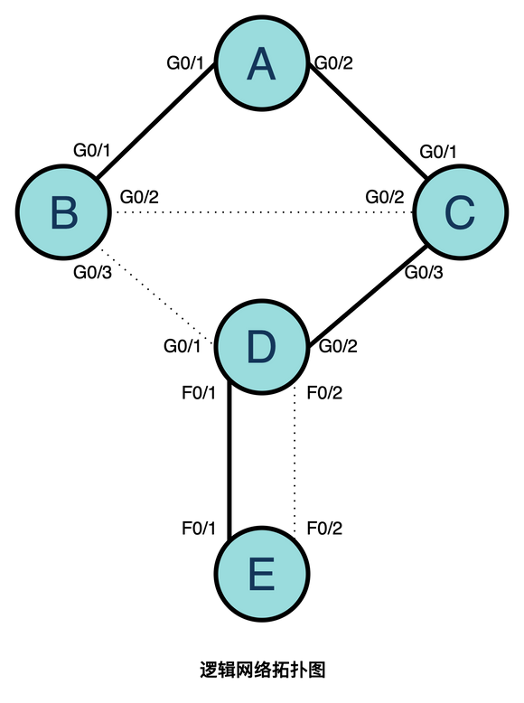
