# 交换机简述

交换机用于局域网（LAN）的数据帧转发。

虽然交换机根据工作位置的不同可以分为广域网交换机和局域网交换机，但是由于其核心功能还是工作在数据链路层，所以更偏向于局域网的工作环境。

> **以太网交换机**
>
> 如果交换机的转发数据的端口都是以太网口，则这样的交换机成为以太网交换机（Ethernet Switch）。
>
> 交换机历史上有较多种类，但目前基本都是以太网交换机，其它的多被市场淘汰。所以这篇文章会以**以太网交换机**为例描述数据链路层传输数据帧的转发原理。

**Q：交换机与网线 Hub 的区别？**

1. 是否具有学习功能：交换机具有学习功能，而 Hub 没有；
2. 工作是半双工/全双工：交换机全双工，而 Hub 半双工；
3. 工作层是物理层还是数据链路层：交换机工作于数据链路层，Hub 工作于物理层。

# 三种转发操作

交换机的基本作用就是用来**转发**帧的。

对于从传输介质进入某一端口的帧有三种转发操作：

1. **泛洪（Flooding）**：交换机从某一端口进来的帧通过其它所有端口转发出去（除帧进入的那个端口），点到多点；
2. **转发（Forwarding）**：从某一端口进来的帧通过另一个端口转发出去，点到点；
3. **丢弃（Discarding）**：从某一端口进来的帧直接丢弃（实际上就是不进行转发）。

​ 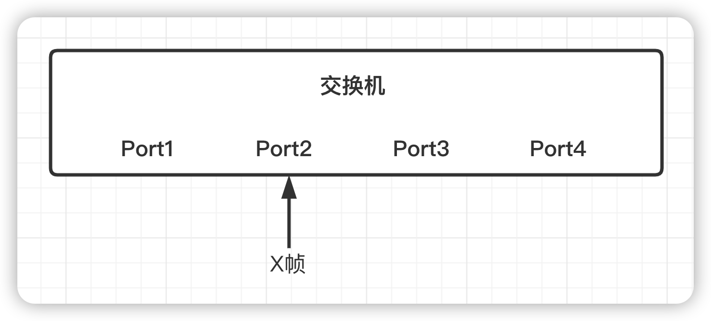

泛洪、转发、丢弃三种操作通常被笼统地称为转发。

# 交换机工作原理

每台交换机中都有一个 MAC 地址表，存放了 MAC 地址与交换机端口编号之间的映射关系。交换机会根据端口收到的帧类型和查询 MAC 表的记录来执行相应的转发操作。

交换机刚上电时，MAC 表没有任何内容，是一个空表。随着交换机不断地转发数据并进行地址学习，MAC 地址表地内容会逐步丰富起来。当交换机下电或重启时，MAC 地址表地内容会完全丢失。

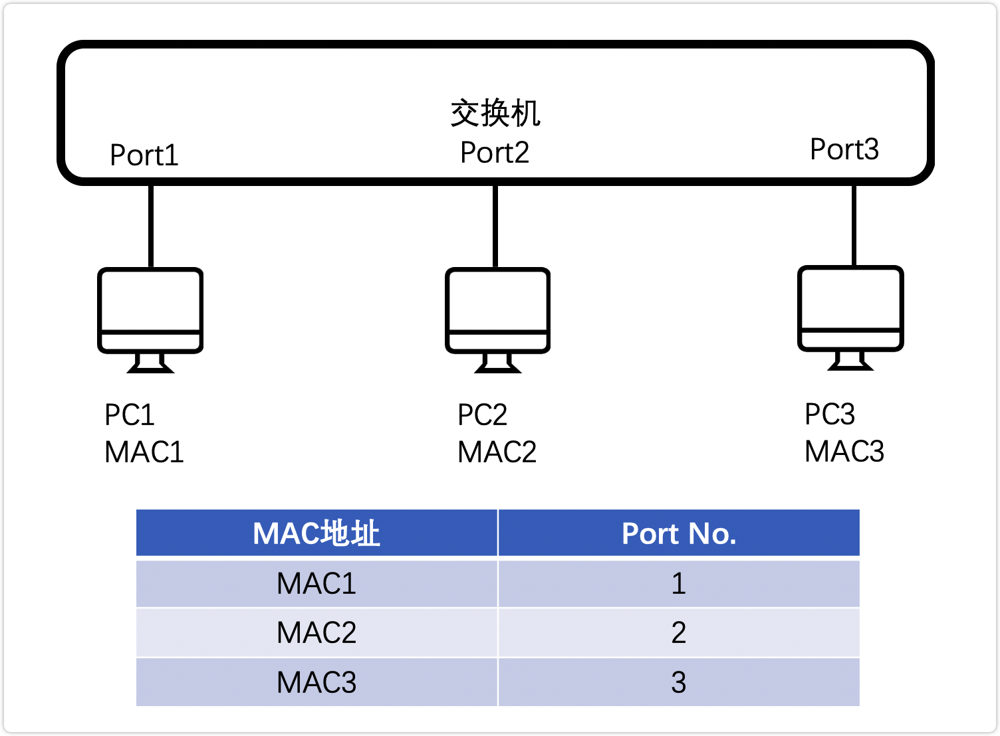

## 数据帧转发区别

- **单播帧**

  一对一的主机通信，是双向通信，主机与主机之间通信的目的地址均是对方的地址。如两台主机传送文件。

  1. 新交换机局域网中（MAC 表为空），先泛洪。不符合目标 MAC 的数据丢弃，同时学习完善 MAC 表，标记 MAC 与 Port 对应关系；点到多点；
  2. 形成 MAC 表后，有明确的 MAC 地址则进行点对点转发。

- **广播帧**

  一对所有的通信，广播源向广播地址发送数据，目的地址是广播地址，整个网络中所有主机均可以收到。如 ARP 地址解析、GARP 数据包等。

  1. 收到广播帧后，交换机不会去查 MAC 表，而是直接对帧进行泛洪操作，这是因为交换机能判断出该帧是一个广播帧；
  2. 同时会学习广播帧来源得 MAC 与 Port 的对应关系记录至 MAC 表。

- **组播帧**

  一对多的通信，是一种单向通信，通信源为组播源（或代理），目的地址是组播地址。通信之前接受组播数据的主机需要通过 IGMP 协议加入组播组，后续可以接收到对应组播组的数据。如 IPTV 等应用。

**MAC 表的学习能力**

当一个帧（单播、组播和广播帧）进行转发时，从传输介质进入交换机后，交换机都会检查这个帧的源 MAC 地址，并将该源 MAC 地址与进入的端口进行映射存入 MAC 表。

## 各情况下交换机转发流程示例


包括单播/广播帧、单/多交换机（桥接）、是否已知目的 MAC 地址等情况下的转发流程。以及交换机的 MAC 表是如何建立起来的。

- 需要注意广播和泛洪是不同的。
  - 广播帧目的地址是`ff:ff:ff:ff:ff:ff` ，而泛洪是普通帧；

### 单播-单交换机

演示单交换机的转发流程，将 PC1、PC2、PC3、PC4 分别接入了同一台交换机的四个端口 Port。

1. **PC1 向 PC3 发送一个单播帧（PC1 已知 PC3 的 MAC 地址）**

   由于 MAC 地址表缺少 PC3 的端口记录，所以转发流程如下：

   1. PC1 单播帧从 Port1 进入后，由于找不到目的 MAC-Port 记录，所以泛洪操作；
   2. PC2 和 PC4 收到后发现目的 MAC 不一致，则丢弃；PC3 收到后目的 MAC 一致，将该帧往上层网络层传递。

   由于 PC1 从 Port1 进入，所以会将 MAC1-Port1 记录至 MAC 表，至此交换机学习到一条记录。

   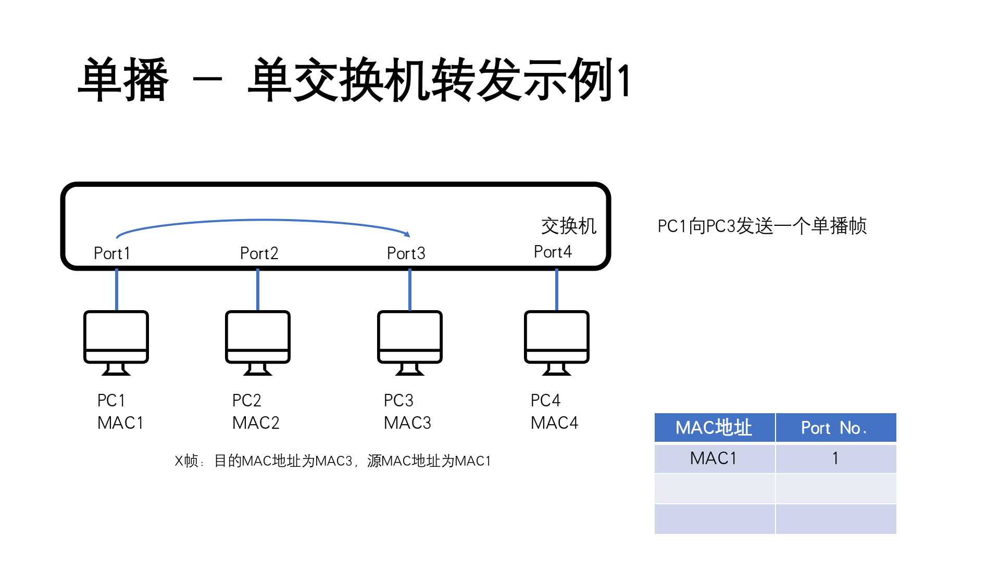

2. **PC4 向 PC1 发送一个单播帧（PC4 已知 PC1 的 MAC 地址）**

   转发流程与第 1 点中的流程完全一致，所以不再赘述。

   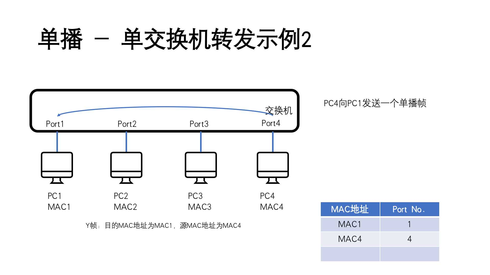

3. **PC1 向 PC5 发送一个单播帧（PC1 已知 PC5 的 MAC 地址）**

   假如此时交换机 MAC 表中存在一条 MAC5-Port1 记录（当 Port1 桥接了另外一个有 PC5 的局域网时会出现这种情况，这里暂且将它视为一条异常的记录）。

   由于 MAC 表中存在一条异常的 MAC5-Port1 异常记录，与 PC1 所在 Port 相同，所以转发流程如下：

   1. 交换机查询 PC1 发起的单播帧目的 MAC5，MAC 表中已有这条 MAC5-Port1 记录，所以执行点对点转发；
   2. 但是 PC1 与 PC5 均为 Port1，所以证明 PC1 和 PC5 均应该在 Port1 一侧，所以交换机直接丢弃该帧，不将该帧从此交换机的其它 Port 转发出去。

   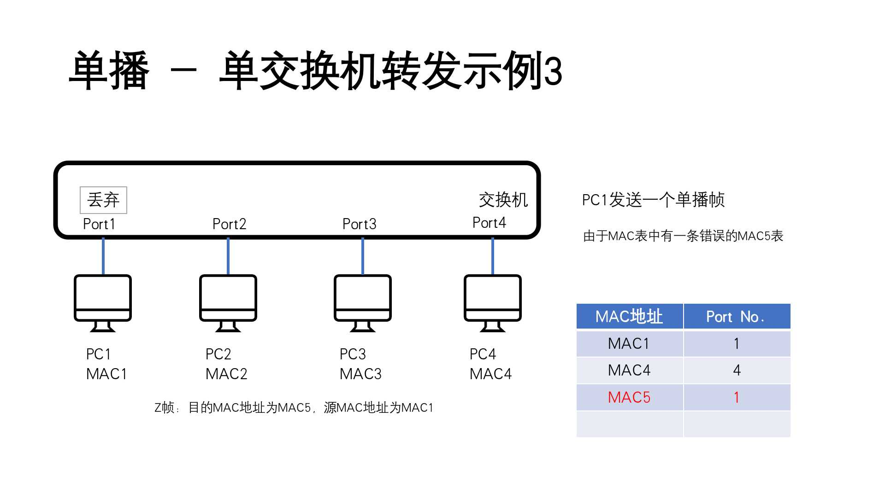

### 广播-单交换机

广播帧的转发流程简单，直接进行泛洪操作即可。

1. **PC3 发起一个广播帧**

   当交换机从 Port3 收到 PC3 发来的广播帧时。交换机发现是一个广播帧则直接转发至每个 Port，同时会将 MAC3-Port3 这个映射关系记录至 MAC 表。

   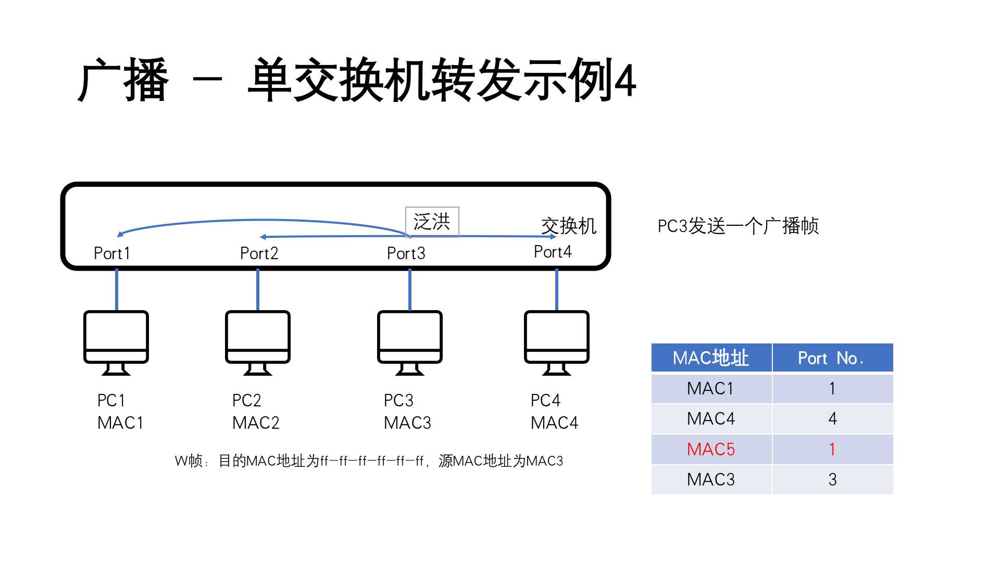

### 单播-多交换机

演示多交换机转发流程，一共引入了三台交换机。

其中 PC1、PC2 分别接入了交换机 1 的两个端口 Port1 和 Port2；PC3 和 PC4 分别接入了交换机 3 的两个端口 Port3 和 Port2；其中交换机 1、交换机 3 通过交换机 2 的 Port1 和 Port2 两个端口桥接起来。

1. **PC1 向 PC3 发起一个单播帧（假设 PC1 已知 PC3 的 MAC 地址）**

   此时三个交换机的 MAC 表均为空，其转发流程如下：

   1. PC1 发起一个目的地为 MAC3 的帧，从 Port1 进入；

   2. 由于交换机 1 MAC 表中找不到 MAC3 的记录，所以会将该数据帧进行泛洪操作，同时会将 MAC1-Port1 这条记录至交换机 1 的 MAC 表中；

   3. 交换机 1 将帧泛洪后该帧会到达 Port2 和 Port3 中

      - Port2 的 PC2 收到后发现目的 MAC 与本机不符，则丢弃该帧；

      - Port3 发出至交换机 2 的 Port1，进入交换机 2 中的转发流程。

   4. 交换机 2 收到从 Port1 进入的帧时，由于交换机 2 MAC 表为空，没有 MAC3 的记录，所以将该数据帧进行泛洪操作，同时会将 MAC1-Port1 记录至交换机 2 的 MAC 表中。

   5. 交换机 2 将该帧泛洪操作后，会从交换机 2 的 Port2 发送至交换机 3 的 Port1。

   6. 交换机 3 收到该帧后，由于交换机 3 的 MAC 表为空，没有 MAC3 的记录，所以交换机 3 进行泛洪操作，同时将 MAC1-Port1 这条记录至交换机 3 的 MAC 表中

      - 交换机 3 Port3 的 PC3 收到该帧后，目的 MAC 地址与本机匹配，将帧去除 MAC 头部后交给上层处理；

      - 交换机 3 Port2 的 PC4 收到该帧后，目的 MAC 地址与本机不符，丢弃。

   至此 PC1 向 PC3 发起的单播帧就转发结束了，同时三个交换机的 MAC 表中都有了一条 MAC1 与 Port 的记录。

   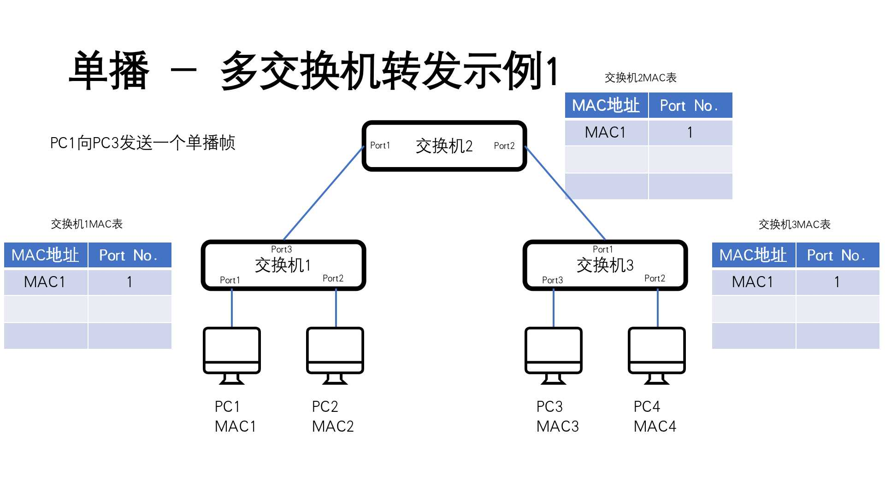

2. **PC4 向 PC1 发起一个单播帧（假设 PC4 已知 PC1 的 MAC 地址）**

   由于经过第 1 步的 PC1 向 PC3 发送单播帧的操作，使得 3 个交换机中均有 MAC1 的记录。所以此时的转发流程如下：

   1. PC4 发起一个单播帧从交换机 3 的 Port2 进入，查询交换机 3 的 MAC 表后找到 MAC1 所在出口为 Port1，所以直接将该帧从交换机 3 的 Port1 中转发出去。同时将 MAC4-Port2 这条记录至交换机 3 的 MAC 表；
   2. 交换机 2 的 Port2 收到该帧后，查询自己的 MAC 表发现 MAC1 所在出口为 Port1，则直接将该帧从交换机 2 的 Port1 转发出去。同时将 MAC4-Port2 这条记录至交换 2 的 MAC 表；
   3. 交换机 1 的 Port3 收到该帧后，查询自己的 MAC 表发现 MAC1 所在出口为 Port1，则直接将该帧从 Port1 转发出去。同时将 MAC4-Port3 这条记录至交换机 1 的 MAC 表；
   4. PC1 收到 PC4 发来的帧后，发现与本机 MAC 地址匹配，遂将该帧去除 MAC 头部后交给上层处理。

   讲过这次帧转发后，各交换机的 MAC 表如下

   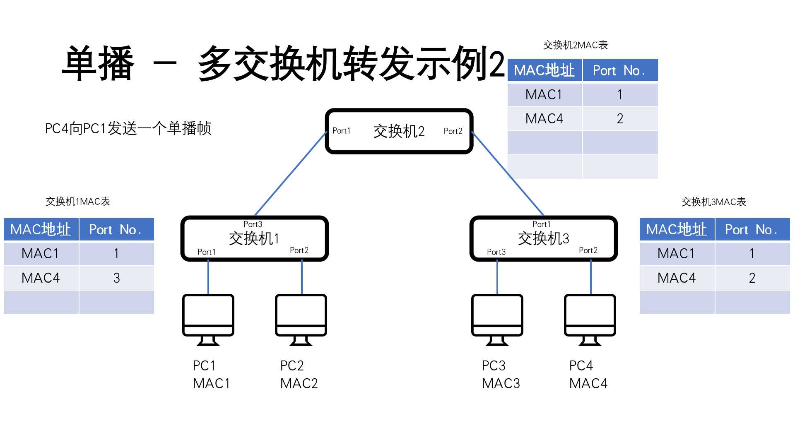

3. **PC2 向 PC1 发起一个单播帧（假设 PC2 已知 PC1 的 MAC 地址）**

   但是由于某些原因（如工作地点变动），PC1 接入局域网由原先的交换机 1 改成了交换机 3。继续沿用上面已有的 MAC 表记录，转发流程如下：

   1. PC2 发起的单播帧从交换机 1 的 Port2 进入后，从交换机 1 的 MAC 表查询到 MAC1 需要从 Port1 转发出去。但是此时 Port1 未接入设备，所以将该帧泛洪操作；同时将 MAC2-Port2 记录至交换机 1 的 MAC 表中；
   2. 交换机 2 从 Port1 收到由交换机 1 泛洪操作来的目的地址为 MAC1 的数据帧后，交换机 2 查询自身 MAC 表发现 MAC1 对应的是 Port1，与数据帧进入的 Port 一致，所以直接丢弃这个帧。同时将 MAC2-Port1 记录至交换机 2 的 MAC 表中。

   通过上面的转发流程可以发现，当 PC1 接入到交换机 3 后，由于交换机 2 的 MAC 表未及时更新，所以 PC2 发起的单播帧无法到达 PC1。不过在实际网络环境中最终依旧会送达，这会在下文中说明原因。

   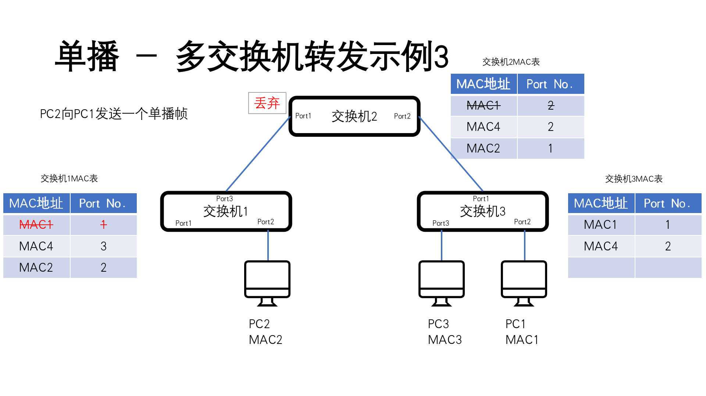

### 广播-多交换机

多交换机的广播转发流程很简单，所有交换机均执行泛洪操作。

1. **PC3 发起一个广播帧**

   1. 广播帧从交换机 3 的 Port3 进入后，交换机 3 进行泛洪操作，更新 MAC 表；
   2. 交换机 2 从 Port2 收到广播帧后，同理进行泛洪操作，更新 MAC 表；
   3. 交换机 1 从 Port3 收到广播帧后，同理进行泛洪操作，更新 MAC 表；

   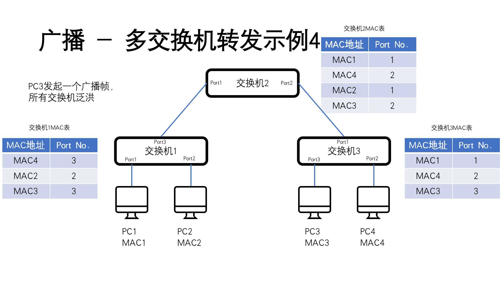

## 数据帧处理

不同的设备对数据帧的处理姿势不同

|        | 单播帧                                                                                                     | 广播帧                                   |
| ------ | ---------------------------------------------------------------------------------------------------------- | ---------------------------------------- |
| 计算机 | 收到的单播帧目的 MAC 与自己 MAC 吻合时，继续交由上层处理，否则丢弃                                         | 收到广播帧时直接交给上层处理             |
| 交换机 | 交换机网卡收到单播帧时，不会将帧目的地址与自己 MAC 比较，而是查 MAC 地址表，然后再决定对单播帧进行何种转发 | 交换机网卡收到广播帧时，直接进行泛洪转发 |

## MAC 地址表

- 交换机的 MAC 地址表也称为 MAC 地址映射表，每一个条目也称为一个地址表项，**地址表项反映了 MAC 地址与端口的映射关系**
- 交换机 MAC 存在缓存中，断电或重启后会完全丢失
- 交换机 MAC 地址表有限
  - 低档：数千条
  - 中档：数万条
  - 高档：几十万条
- MAC 地址老化机制
  - 原因：
    - 网络中的位置发生变化后，导致错乱
    - MAC 地址过多导致查询时间过长

# 地址解析协议-ARP

上述所例举的交换机的转发流程中，PC 向另外一台 PC 发送数据帧的前提都是已知目的 MAC 地址的。

刚接入的设备是不太可能知道局域网中目设备的 MAC 地址的，那如何去获取目的设备的 MAC 地址呢？这时就需要用到 ARP 协议。

ARP（Address Resolution Protocol） 地址解析协议，是一个**网络层**协议，涉及一些数据链路层信息。**基本作用是根据已知的 IP 地址获得其对应的 MAC 地址。**

## ARP 缓存表

**ARP 缓存表是用来临时存放 IP 地址与 MAC 地址的对应关系的：**

- 当某一设备需要向目的设备发送单播帧的时候，会先查看自己的 ARP 缓存表中是否已经有了目的设备的 MAC 地址。如果有，就直接使用它；如果没有就会发起 ARP 请求获取它；
- 也具有缓存特性；
- Note: 一次广播，所有接收主机将源主机 IP 和 MAC 放入自己的缓存表。

如何查看 ARP 缓存表

- Linux 下查看

  ```bash
  # 显示eno1 网口下所有arp缓存列表
  ➜  ~ arp -v -i eno1
  Address                  HWtype  HWaddress           Flags Mask            Iface
  172.16.5.51              ether   74:d4:35:ea:57:c9   C                     eno1
  _gateway                 ether   48:7a:da:66:ce:2c   C                     eno1
  172.16.5.48              ether   fc:aa:14:62:c7:0d   C                     eno1
  Entries: 86	Skipped: 83	Found: 3
  ```

- MacOS 下查看

  ```bash
  ➜  ~ arp -an
  ? (10.112.192.1) at d2:d3:c2:fc:d3:5 on feth747 ifscope [ethernet]
  ? (10.112.192.255) at ff:ff:ff:ff:ff:ff on feth747 ifscope [ethernet]
  ? (172.16.88.9) at 78:88:6d:a1:a8:8f on en1 ifscope [ethernet]
  ? (172.16.88.20) at 6:a1:a5:10:6b:80 on en1 ifscope [ethernet]
  ? (172.16.88.48) at 3c:22:fb:a8:e3:58 on en1 ifscope [ethernet]
  ? (172.16.88.69) at 58:e2:8f:40:d:90 on en1 ifscope [ethernet]
  ? (172.16.88.77) at 14:98:77:5c:cc:bc on en1 ifscope [ethernet]
  ? (172.16.88.176) at f4:5c:89:bc:5:e3 on en1 ifscope [ethernet]
  ? (172.16.88.254) at 48:7a:da:66:ce:2c on en1 ifscope [ethernet]
  ```

- Windows 下查看

  ```shell
  PS C:\Users\imwoo> arp -a

  接口: 192.168.2.126 --- 0x6
    Internet 地址         物理地址              类型
    192.168.2.1           b6-b9-75-63-3f-3e     动态
    192.168.2.113         f4-d4-88-71-8f-25     动态
    192.168.2.211         c6-ec-02-8b-96-ce     动态
    192.168.2.233         24-5e-be-51-d1-f7     动态
    192.168.2.234         24-5e-be-51-d1-f8     动态
    192.168.2.255         ff-ff-ff-ff-ff-ff     静态
    224.0.0.2             01-00-5e-00-00-02     静态
    224.0.0.22            01-00-5e-00-00-16     静态
    224.0.0.251           01-00-5e-00-00-fb     静态
    224.0.0.252           01-00-5e-00-00-fc     静态
    230.230.230.230       01-00-5e-66-e6-e6     静态
    239.255.255.250       01-00-5e-7f-ff-fa     静态
    255.255.255.255       ff-ff-ff-ff-ff-ff     静态
  ```

## ARP 工作流程

假如在同一局域网内，PC1 需要发送数据给 PC2，但是 PC1 并不知道 PC2 的 MAC 地址，所以此时就会用到 ARP 协议来获取 PC2 的 MAC 地址。

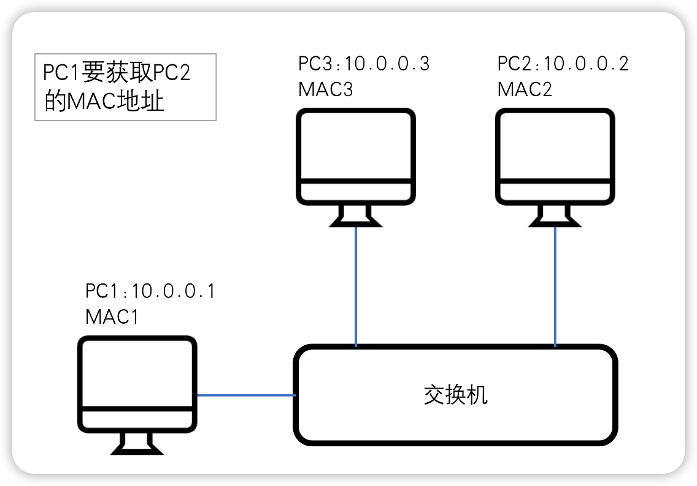

**具体的工作流程如下：**

1. PC1 发起一个广播帧，源 MAC 为 MAC1。类型字段 0x0806，表明为 ARP 报文（请求）；
2. PC2 和 PC3 收到后将 ARP 请求报文上送至 ARP 处理模块；
3. PC3 发现不是自己的 IP 则不会应答，同时将 ARP 请求报文中的 10.0.01 与 MAC1 对应关系放入自己的 ARP 缓存；
4. PC2 发现与自己 IP 吻合则应答；
5. PC2 应答时会向 PC1 发送一个单播帧，源 MAC 为 MAC2，目的 MAC 为 MAC1。是一个 ARP 应答报文。同时也会将 ARP 请求报文中的 10.0.0.1 与 MAC1 的对应关系放进自己的 ARP 缓存表；
6. PC1 收到 PC2 发送的单播帧后，会将应答报文交给三层的 ARP 处理模块。同时会将 10.0.0.2 与 MAC2 的对应关系放入缓存表。

# 参考

- 华为 HCNA 网络技术
- [交换机支持单播、组播、广播吗？ - 商用网络](https://smb.tp-link.com.cn/service/detail_article_393.html)
- [Linux arp 命令详解](https://wangchujiang.com/linux-command/c/arp.html)
